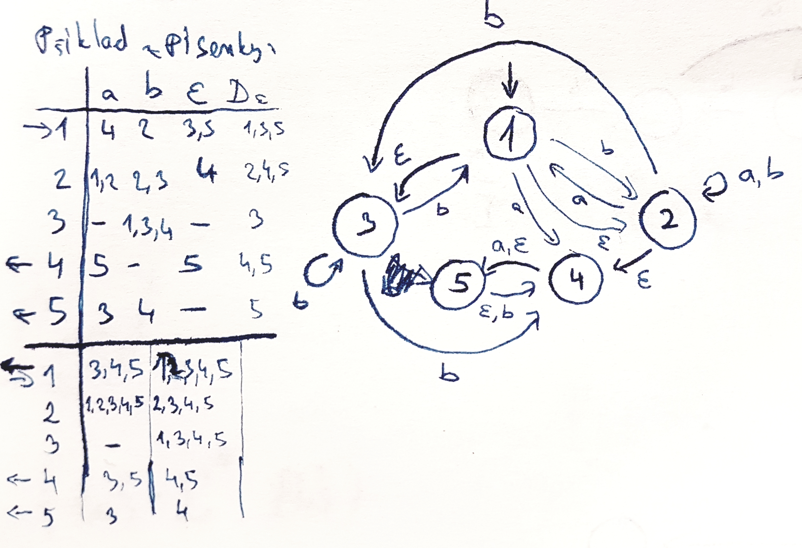
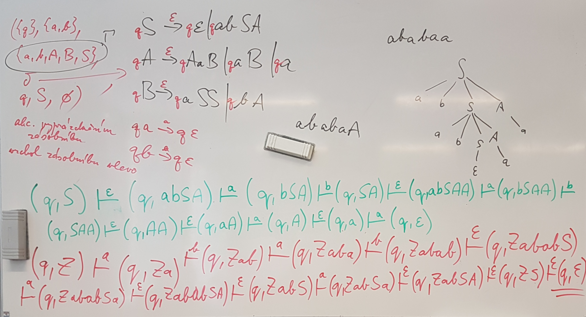
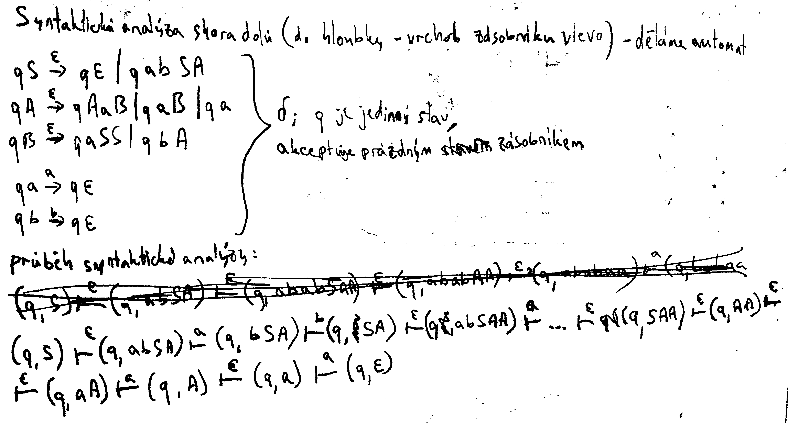

# Formální jazyky a automaty

### Palčivé otázky
- Rozdíly v regulárních automatech / zásobníkových automatech a turingovu stroji na 2 věty a méne
- Totální přechodová fce: rozdíl TDFA a DFA	-- done
- Saturace == nasycuje == respektuje	-- done
- Pravá / levá kongruence	-- done
- Gramatika typu _xyz_

### Základní formalismy

$$$ L^0 = \{ \epsilon \} $$$
$$$ L^+ = \bigcup \limits_{n \in \mathbb N^+} L^n $$$
$$$ L^* = \bigcup \limits_{n \in \mathbb N} L^n $$$

## Regulární jazyky

- přehled :

***6 možných formalismů RV*** -- dokázat, že daný jazyk je regulární

- Deterministický konečný automat (DFA)
- Nedeterministický konečný automat (NFA)
- Nedeterministický konečný automat s $$$\epsilon$$$ kroky ($$$\epsilon$$$NFA)
- Regulární transition graphs (RTG)
- Regulární výrazy (RE)
- Regulární gramatiky (RG)

***Dokázat, že daný jazyk není regulární***

- **pumping lemma**

***Kolik paměti je potřeba na rozkódování daného jazyka***

- minimální automat
- pravá kongruence
- prefixová ekvivalence
- [Myhillova-nerodova věta](https://cs.wikipedia.org/wiki/Myhillova%E2%80%93Nerodova_v%C4%9Bta)

### Deterministický konečný automat (DFA)

- $$$Q \ldots $$$ konečná množina stavů
- $$$\Sigma \ldots$$$ (konečná) množina vstupních znaků (abeceda)
- $$$\delta: Q × \Sigma \rightarrow Q \ldots$$$ (parciální) přechodová fce
- $$$q_0 \in Q \ldots $$$  počáteční stav
- $$$F \subseteq Q \ldots $$$ množina kaceptujících stavů
- $$$\hat \delta : Q × \Sigma^* \rightarrow P(Q) \ldots $$$ rozšířená přechodová fce:
- 
	- $$$ \hat \delta (q, \epsilon) = q $$$
	- $$$ \hat \delta (q, au) = \hat \delta  (\delta (q, a), u) $$$ pro lib. $$$a \in \Sigma, u \in \Sigma ^ *, q \in Q$$$
 

Př.:
- děfinujte DFA

### Nedeterministický konečný automat (NFA)

- $$$Q \ldots $$$ konečná množina stavů
- $$$\Sigma \ldots$$$ (konečná) množina vstupních znaků (abeceda)
- $$$\delta: Q × (\Sigma \cup \langle \epsilon \rangle) \rightarrow Q \ldots$$$ (parciální) přechodová fce
- $$$q_0 \in Q \ldots $$$  počáteční stav
- $$$F \subseteq Q \ldots $$$ množina kaceptujících stavů
- $$$\hat \delta : Q × \Sigma^* \rightarrow P(Q)\ldots$$$ rozšířená přechodová fce

### Nedeterministický konečný automat s $$$\epsilon$$$ kroky ($$$\epsilon$$$NFA)

- PŘEDĚLAT!!!
- $$$Q \ldots $$$ konečná množina stavů
- $$$\Sigma \ldots$$$ (konečná) množina vstupních znaků (abeceda)
- $$$\delta: Q × (\Sigma \cup \langle \epsilon \rangle) \rightarrow PQ \ldots$$$ (parciální) přechodová fce
- $$$q_0 \in Q \ldots $$$  počáteční stav
- $$$F \subseteq Q \ldots $$$ množina kaceptujících stavů
- $$$\hat \delta : Q × \Sigma^* \rightarrow P(Q)\ldots$$$ rozšířená přechodová fce
- 	- $$$\widehat \delta (q, \epsilon) = D_\epsilon (q)$$$
	- $$$\overline D_\epsilon = \bigcup \limits_{p \in P} D_\epsilon (p)$$$ pro libovolný $$$p \subseteq Q$$$

***Př.:***

***Př.:***	Rozhodněte, jestli je $$$L = {a^n b^n| n \in \mathbb N} $$$ regulární -- *Pumping lemma*
- Předpokládejme pro spor, že $$$L$$$ je regulární
- Pak existuje TDFA $$$\mathbb A = (Q, \Sigma, \delta, q_0, F)$$$, takový, že $$$\mathbb L(\mathbb A) = L$$$.
- Označme $$$n = |Q|$$$. Uvažme slovo $$$w = a^n b^n \in L$$$. Podle Dirichletova principu existují $$$i, j \in {0, 1, ..., n}$$$, BÚNO $$$i < j$$$, takové, že $$$\widehat \delta (q_0, a^i) = \widehat \delta (q_0, a^j)$$$ (označme tento stav $$$p$$$).
- Platí tedy, že $$$\widehat \delta(p, a^{j-i}) = p$$$.
- Uvažme slovo $$$w' = a^{n +j-i}b^n = a^i a^{j-i} a ^{j-i} a ^{n-j} b^n$$$.
- Pak $$$\widehat \delta(q_0, w') = ... = \widehat \delta(p, a^{n-j}b^n) = ... = \widehat \delta (q_0, w)$$$
- Platí $$$w \int L$$$, tedy $$$\widehat \delta (q_0, w) \in F$$$, ale $$$w'\not \in L $$$, tedy $$$\widehat \delta(q_0, w') \not \in F$$$, což je spor, neboť $$$\widehat \delta (q_0, w) = \widehat \delta(q_0, w= )$$$.

#### Pumping Lemma

- Předpoklad: jazyk je regulární $$$\Rightarrow$$$ existuje konečný automat s konečnou množinou stavů ($$$n$$$ stavů), tak dle Dirichletova principu dojde pro dostatečně dlouhé slovo k zopakování stavu. Tento cyklus označíme $$$y$$$, část před cyklem $$$x$$$ a část za cyklem $$$z$$$.

	Musí pak platit, že nezávisle na tom, kolikrát "napumpujeme" $$$y$$$, tak slovo zůstane popsatelné tímto automatem.
- $$$L$$$ je regulární $$$\Rightarrow$$$
	$$$(\exists n \in \mathbb N^+)(\forall w \in \Sigma ^ *)(|w| \geq n \Rightarrow (\exists x, y, z \in \Sigma ^*)$$$
	$$$(w = xyz \wedge y \not = \epsilon \wedge |xy| \leq n \wedge (\forall i \in \mathbb N)(xy^i z \in L \Leftrightarrow w \in L)))$$$
	
- Vyvrácení regularity obměnou:
	Postup: "snažím se vypumpovat z jazyku"
0. soupeř zadá $$$n$$$
1. vymyslím slovo v závislosti na $$$n$$$
2. soupeř zadá rozdělení mezi $$$x, y, z$$$
3. já vymyslím $$$i$$$ kdterým to přepumpuji

#### Myhillova–Nerodova věta

- Nechť $$$L$$$ je jazyk. Následující výroky jsou ekvivalentní:

1. $$$L$$$ je regulární
2. existuje práva kongruence $$$\sim \subseteq (\Sigma^*)^2$$$ s konečným indexem, která saturuje $$$L$$$
3. $$$\sim_L$$$ má konečný index

***Def.:*** **Saturuje**
- pravá kongruence $$$\sim$$$ nad $$$\Sigma ^ * $$$ **saturuje** (nasycuje, respektuje, _respektive???_) jazyk $$$ L \subseteq \Sigma ^ * \Leftrightarrow L$$$ je sjednocení některých (0 až všech) podmnožin rozkladu $$$\Sigma ^* / \sim$$$

***Def.:*** **Prefixová ekvivalence**
- ???

## Neregulární jazyky

### Bezkontextové gramatiky (CFG)

- uspořádaná čtveřice: $$$\mathcal G = (N, \Sigma, P, S)$$$
    - $$$N \ldots$$$ konečná množina neterminálů
    - $$$\Sigma \ldots$$$ konečná množina terminálů
    - $$$P \ldots$$$ konečná množina pravidel
    - $$$S \ldots$$$ konečná množina počátečních pravidel
- na levé straně je vždy právě jeden neterminál

***Def.:***
- Neterminál $$$X$$$ je **dosažitelný** $$$\;\Leftrightarrow (\exists \alpha, \beta \in (N \cup \Sigma)^* )(S \Rightarrow^* \alpha X\beta)$$$
- Neterminál $$$X$$$ je **normovaný** $$$\;\Leftrightarrow (\exists w \in \Sigma ^*)(X \Rightarrow^* w)$$$
- Neterminál $$$X$$$ je **použitelný** $$$\;\Leftrightarrow (\exists \alpha, \beta \in (N \cup \Sigma)^* )(\exists w \in \Sigma^*)(S \Rightarrow ^* \alpha X \beta \Rightarrow ^* w)$$$
- Gramatika je **redukovaná** $$$\; \Leftrightarrow$$$ všechny neterminály jsou použitelné
- Gramatika má vlastnost **sebevložení** $$$\; \Leftrightarrow (\exists A \in N)(\exists u, v \in \Sigma ^+)(A \Rightarrow ^* uAv)$$$
- Gramatika je **jednoznačná** 
	$$$\; \Leftrightarrow$$$ pro každé slovo generované danou gramatikou existuje právě jedno *nejlevější odvození*
    $$$\;\Leftrightarrow$$$ existuje právě jeden **derivační strom** pro každé slovo generované danou gramatikou
- Gramatika je **cyklická** $$$\; \Leftrightarrow (\exists A \in N)(A \Rightarrow ^+ A)$$$ 
- Gramatika je **vlastní** $$$\; \Leftrightarrow$$$ je bez $$$\epsilon$$$ pravidel $$$\wedge$$$ necyklická $$$\wedge$$$ redukovaná
- Gramatika je bez **$$$\epsilon$$$ pravidel** $$$\; \Leftrightarrow$$$ jediný $$$\epsilon$$$ krok je $$$S \rightarrow \epsilon$$$ a $$$S$$$ není na pravé straně žádného pravidla

**Věta**:
- Gramatika je regulární $$$\; \Leftrightarrow$$$ gramatika nemá vlastnost sebevložení
- Jazyk je regulární $$$\; \Rightarrow$$$ jazyk je jednoznačný

> _Jaký je vztah mezi regularitou a sebevložením?_
	_Nemají se rádi: Dávno se rozešli a nikdy se od tédoby neviděli._

**Redukování gramatiky**
1. odstraním nenormované neterminály
2. odstraním nedosažitelné neterminály

***Přepsání CFG s $$$\epsilon$$$ slovy na CFG bez $$$\epsilon$$$ slov***
1. odstraním pravidla přímo travu: $$$A \rightarrow \epsilon$$$
2. vytvořím až $$$\,2^n$$$ pravidel, kde $$$n$$$ je počet výskytů $$$\epsilon$$$ pravidel

***Př.:***
- $$$\{a^ib^jc^jd^i | i,j \in \mathbb N\}$$$: $$$S \rightarrow aSd \;|\;E; \;E \rightarrow bEc \;|\; \epsilon $$$

#### **Chunského normální forma **
- ***Def.:***
    - Gramatika $$$\mathcal G$$$ je vlastní $$$\wedge$$$ pravidla jsou tvaru $$$A \rightarrow a | BC$$$

- ***Postup:***
    1. Odstraním nenormované neterminály (a pravidla s nimi)
    2. Odstraním nedosažitelné neterminály (a pravidla s nimi)
    3. Odstranění $$$\epsilon$$$ pravidel (přidat pravidla, kde je neterminál přepisující se na $$$\epsilon$$$)
    4. Odstranění jednoduchých pravidel
    5. Pravidla delší jak 2 rozsekám:
        - $$$ S \rightarrow SaSbS $$$ 
          na 
        - $$$ S \rightarrow S\text < aSbS \text > $$$
          $$$ \text < aSbS \text > \rightarrow a\text < SbS \text > $$$
          $$$ \text < SbS \text > \rightarrow S\text < bS \text > $$$
          $$$ \text < bS \text > \rightarrow bS $$$
    5. Začárkuji nesamostatné terminály:
        - $$$ S \rightarrow S\text < aSbS \text > $$$
          $$$ \text < aSbS \text > \rightarrow a\text < SbS \text > $$$
          $$$ \text < SbS \text > \rightarrow S\text < bS \text > $$$
          $$$ \text < bS \text > \rightarrow bS $$$
          na 
        - $$$ S \rightarrow S\text < aSbS \text > $$$
          $$$ \text < aSbS \text > \rightarrow a'\text < SbS \text > $$$
          $$$ \text < SbS \text > \rightarrow S\text < bS \text > $$$
          $$$ \text < bS \text > \rightarrow b'S $$$
          $$$ a' \rightarrow a$$$
          $$$ b' \rightarrow b$$$

#### Pumping lemma v.2

***Def.:***
- gramatika $$$\mathcal L$$$ je bezkontextová $$$\; \Rightarrow$$$
  $$$(\exists n \in \mathbb N)(\forall w \in \mathcal L)$$$
  $$$\; \;(|w| \geq n \Rightarrow (\exists u, v,x, y, z \in \Sigma ^*)$$$
  $$$\; \; \; \;(w = uvxyz \wedge vy \not = \epsilon \wedge |vxy| \leq n \wedge (\forall i \in \mathbb N)(uv^i xy^i z \in \mathcal L)$$$
  $$$\;\;)$$$
  $$$)$$$

***Př.:***
- Nechť $$$n \in \mathbb N$$$. Uvažme slovo $$$w = a^nb^nc^n$$$. Zřejmě $$$|w| \geq n$$$ a $$$w \in \mathcal L$$$.
  Nechť $$$u,v,x, y, z\in \Sigma^*$$$ jsou taková, že $$$w = uvxyz, vy \not \in \epsilon, |vxy| \leq n$$$.
  Uvažme slovo $$$w_0 = uxz$$$. Ukážeme, že $$$w_0 \not \in \mathcal L$$$:
  
  Z $$$|vxy| \geq n$$$ plyne, že $$$vy$$$ neobsahuje nějaký znak $$$d \in \{a, c\}$$$.
  Z $$$vy\not = \epsilon$$$ plyne, že $$$vy$$$ obsahuje nějaký znak $$$e \in \{a, b, c\}$$$.
  
  Tedy $$$\#_d(w_0) = \#_d(w) - \#_d(vy) = n - 0 = n$$$,
  ale $$$\#_e(w_0) = \#_e(w) - \#_e(vy) < n$$$, proto $$$w \not \in \mathcal L$$$.
  ($$$\#_e(w) = n$$$, $$$\#_e(vy) > 0$$$)
  

### Zásobníkový konečný automat s $$$\epsilon$$$ kroky (PDA)

***Def.:*** sedmice $$$\mathcal A = (Q, \Sigma, \Gamma, \delta, q_0, Z_0, F)$$$

- $$$Q \ldots $$$ konečná množina stavů
- $$$\Sigma \ldots$$$ (konečná) množina vstupních znaků (abeceda)
- $$$\Gamma \ldots $$$ konečná množina zásobníkových stavů
- $$$\delta: Q × (\Sigma \cup \{ \epsilon \} ) × \Gamma \rightarrow P_{fin} (Q × \Gamma ^*)  \ldots$$$ (parciální) přechodová fce
- $$$q_0 \in Q \ldots $$$  počáteční stav
- $$$Z_0 \in \Gamma \ldots $$$  počáteční stav v zásobníku
- $$$F \subseteq Q \ldots $$$ množina kaceptujících stavů

- $$$(p, u, \alpha) \vdash (q, v, \beta); \; p,q \in Q; u, v \in \Sigma ^*; \alpha, \beta \in \Gamma ^*$$$
    - $$$(\exists a \in \Sigma \cup \{\epsilon\})(u = a \cdot v$$$
    	$$$\wedge (\exists \gamma \in \Gamma)(\exists \omega, \xi \in \Gamma ^*)(\alpha = \xi \cdot \gamma \wedge \beta = \xi \cdot \omega \wedge (q, \omega) \in \delta (p, a, \gamma)))$$$

- $$$\mathcal L(\mathcal A) = \{w \in \Sigma^* : (\exists q \in F)(\exists \alpha \in \Gamma ^*)((q_0, w, Z_0) \vdash ^* (q, \epsilon,\alpha)) \}$$$
- $$$\mathcal L_ \epsilon(\mathcal A) = \{w \in \Sigma^* : (\exists q \in Q)((q_0, w, Z_0) \vdash ^* (q, \epsilon,\epsilon)) \}$$$

### Uzávěrové vlastnosti bezkontextových jazyků

- $$$\cup$$$ -- $$$\surd $$$ -- $$$\mathcal G = (\_, \_, (S \rightarrow S_1 || S_2), \_)$$$.
- $$$\cap$$$ -- $$$ × $$$ -- $$$\mathcal L = \{w \in \{a,b,c\}^* : \text { stejný počet } a, b \text { a } b, c \}$$$.
- co- -- $$$×$$$ -- důkaz $$$\mathcal L_1 \cap \mathcal L_2 = (\mathcal L_1^c \cup \mathcal L_2^c)^c$$$. (complement)
- R -- $$$\surd $$$ -- obrátím pravidla v gramatice (reverse)
- $$$\cdot$$$ -- $$$\surd$$$ -- $$$\mathcal G = (\_, \_, (S \rightarrow S_1 \cdot S_2), \_)$$$.
- $$$*$$$ -- $$$\surd$$$ -- opakované zřetězení

### Zásobníkový konečný automat bez $$$\epsilon$$$ kroků (PDA)

***Def.:*** sedmice $$$\mathcal A = (Q, \Sigma, \Gamma, \delta, q_0, Z_0, F)$$$

- $$$Q \ldots $$$ konečná množina stavů
- $$$\Sigma \ldots$$$ (konečná) množina vstupních znaků (abeceda)
- $$$\Gamma \ldots $$$ konečná množina zásobníkových stavů
- $$$\delta: Q × (\Sigma \cup \{ \epsilon \} ) × \Gamma \rightarrow P_{fin} (Q × \Gamma ^*)  \ldots$$$ (parciální) přechodová fce
- $$$q_0 \in Q \ldots $$$  počáteční stav
- $$$Z_0 \in \Gamma \ldots $$$  počáteční stav v zásobníku
- $$$F \subseteq Q \ldots $$$ množina kaceptujících stavů

| operace / uzavřeno nad | reg | bezkont. nedeter | bezkont. determin |
|:----------------------:|:---:|:----------------:|:-----------------:|
| $$$\cup$$$             |  ✔  |         ✔        |         ✘         |
| $$$\cap$$$             |  ✔  |         ✘        |         ✘         |
| co-                    |  ✔  |         ✘        |         ✔         |
| R                      |  ✔  |         ✔        |         ✘         |
| $$$\cdot$$$            |  ✔  |         ✔        |         ✘         |
| $$$ * $$$              |  ✔  |         ✔        |         ✘         |

- $$$\forall$$$ co nedeterministické + tyto podmínky:

1.	$$$(\forall q \in Q \wedge \forall a \in \Sigma \cup \{\epsilon\} \wedge \forall \alpha \in \Gamma) ( |\delta (q, a, \alpha) | \leq 1)$$$
2.	$$$(\forall q \in Q)(\forall \alpha \in \Gamma)(\forall a \in \Sigma)(|\delta (q, a, \alpha)| + |\delta (q, \epsilon, \alpha)| \leq 1))$$$

### Syntaktická analýza 
či **syntaktický analizátor **= (fancy název pro převod z **gramatiky** na **automat**)

##### Syntaktická analýza shora
***HOWTO:***
- Nechť je vrchol automatu vlevo

##### Syntaktická analýza zdola
***HOWTO:***
- Nechť je vrchol automatu vpravo

## Rozhodnutelnost

- Pro jazyky
    - rekurzivní ($$$\approx$$$ rozhodnutelný) -- skončí a řekne ANO / NE
    - rekurzivně spočetný ($$$\approx$$$ částečně rozhodnutelný) -- skončí (ANO) / cyklí (NE)

- Pro problém
    
    - rozhodnutelný ($$$\approx$$$ rekurzivní) -- skončí a řekne ANO / NE
    - částečně rozhodnutelný ($$$\approx$$$ rekurzivně spočetný) -- skončí (ANO) / cyklí (NE)

***Př.:*** (ekvivalentní jazyk × problém)
- $$$\mathcal L = \{ w \in \{a, b\}^* : |w| \mod 2 = 0\}$$$ je regulární
- problém, zda slovo má sudou délku, je rozhodnutelný s konstantní pamětí

***Př.:***
- Problém zastavení není rozhodnutelný, ale je částečně rozhodnutelný
- TM není ani rekurzivně spočetný: komplement k rekurzivně spočetnému

***Věta:***
- $$$\mathcal L$$$ je rekurzivní $$$\Leftrightarrow \mathcal L$$$ i $$$\mathcal L^c$$$ jsou rekurzivně spočetné

### Turingův stroj

***Def.: *** je devítice $$$\mathcal M = (Q, \Sigma, \Gamma, \delta, \rhd, \_, q_0, q_a, q_n)$$$

- $$$Q \ldots $$$ konečná množina stavů
- $$$\Sigma \in \Gamma\ldots$$$ (konečná) množina vstupních znaků (abeceda)
- $$$\Gamma \ldots $$$ konečná množina pracovních stavů
- $$$\delta: (Q - \{q_a, q_n\}) × \Gamma \rightarrow Q × \Gamma × \{-1, 1\}  \ldots$$$ (parciální) přechodová fce
- $$$\rhd \in \Gamma\ldots$$$ levá zarážka
- $$$\_ \in \Gamma\ldots$$$ symbol prázdného políčka
- $$$q_0 \in Q \ldots $$$  počáteční stav
- $$$q_a \in Q \ldots $$$  akceptující stav
- $$$q_n \in Q \ldots $$$  zamítající stav

**Množina všech konfigurací**:
- $$$\vdash \ldots$$$ krok výpočtu
- $$$A = \{ y\_^\omega | y \in \Gamma ^* \}$$$
- $$$\vdash \subseteq (Q × A × \mathbb N)^2 $$$
- $$$(p, x, i) \vdash (q, y, j) \Leftrightarrow$$$
	$$$\delta ( p, x_i) = (q, y_i,j - i) \wedge (\forall k \in \mathbb N) (k \not = i \Rightarrow x_k = y_k)$$$ pro libovolné $$$p, q \in Q;\; x, y \in A; \;i, j \in \mathbb N$$$

- $$$\mathcal L (\mathcal M) = \{ w \in \Sigma ^*: (\exists x \in A)(\exists i \in \mathbb N)  ((q_0, \rhd w \_^ \omega, 0) \vdash^* (q_a, x, i)) \}$$$

> Ještě to nechápete?
> Tak já zkusím něco šílenějšího, ať to pochopíte.

