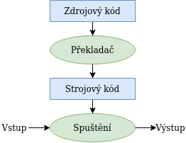
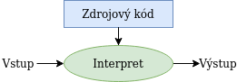

 
# 1. Programovací jazyky
## Datové struktury programovacích jazyků
*datová struktura* = způsob uložení informací
- seznam
- n-tice
- množina
- slovník
- halda
- prioritní fronta
- fronta
- zásobník
- vyhledávací strom
- červeno-černý strom
- B-strom
- hašovací tabulka

## Řídící struktury programovacích jazyků
**C, Java, ...**:
if ... else, for, while, do ... while, switch

**Python**:
if...elif...else, while, for

**Haskell**:
:edit, :load, :quit, :?

**Prolog**:
repeat...until

## Datové typy
určují, jakých *hodnot* může objekt nabývat
- **numerické**: int, float, double, ...
- **znakové**: char
- **ukazatelový typ**: \*
- **definované uživatelem**: struct, union, enum
určují, jaké *operace* lze s objektem provádět

- **netypované jazyky** - bez typů
- **slabě typované jazyky** - jazyk přidělí typ při použití -> neočekávané výsledky
- **silně typované jazyky** - striktní pravidla

**modifikátory datových typů**: signed, unsigned, short, long, long long

## Klasifikace programovacích jazyků:
- **Imperativní** - jak to naprogramovat (C, Java)
- **Deklarativní** - co má být výsledkem? (Prolog, Haskell)

- **Vyšší (vysokoúrovňové)** - větší míra abstrakce (Java, Python)
- **Nižší (nízkoúrovňové)** - podobá se strojovým instrukcím (C)

### Programovací paradigmata
- **logické** (Prolog)
- **funkcionální** (Haskell)
- **OOP** (Java, C++, Smalltalk)

## Kompilace
1. *Preprocessing* - rozvinutí maker, expanze #include...
2. *Kompilace* - syntaktická kontrola kódu, překlad do assembleru
3. *Sestavení* - převod do strojového kódu
4. *Linkování* - nahrazení relativních adres absolutními

- nízkoúrovňové jazyky
- náročnější vývoj
- vysoká efektivita programu
- explicitní práce s pamětí
- nutno řešit specifika systémů

například:
C, C++, Haskell, Go, Java, Pascal

## Interpretace
- pro spuštění kódu potřebujeme interperet
- vysokoúrovňové jazyky
- nezávislé na konkrétním systému
- nižší efektivita programu
- snadný vývoj
- jazyky využívají abstraktní datové typy

například:
Python, PHP, Ruby, JavaScript

|| Java převádí do tzv. bytekódu, 
