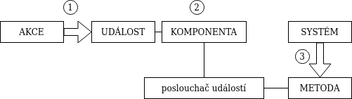

# Objektově orientované programování
## Objektově orientované programování v imperativním jazyce
### OOP
- znovu použitelnost
- pohled člověka, nikoliv stroje
- objekt + atributy + metody

### OOP v imperativním jazyce
- dle zásad OOP
- obsahy metod píšeme imperativně

### imperativní programování
- co se má v daném okamžiku stát
- kopíruje způsob činnosti počítačů

## Spolupráce objektů
### Mechanismus zpráv
- Každý objekt má vlastní _protokol zpráv_, který udává množinu zpráv, na které je objekt schopen reagovat.
- Na každou zprávu je ve protokolu zpráv mapována metoda, která se provede (1:1).
- Zprávy mohou být _bezparametrické_ (zjištění stavu objektu) nebo _parametrické_ (změna stavu objektu).
- Spolupráce prostřednictvím posílání zpráv může probíhat mezi _dvěma objekty_ nebo mezi _uživatelem a objektem_.

## Rozhraní
= specifikace vlastností tříd objektů bez okamžité implementace.

- Ostatní třídy komunikují s třídou implementující rozhraní pomocí tohoto rozhraní.
- _Třída implementuje rozhraní_, pokud má všechny metody, které rozhraní předepisuje.

### V Javě
- pojmenovaná množina hlaviček metod
- typicky public
- jedna třída může implementovat víze rozhraní (ale ne dědit víc tříd)
- při implementaci více rozhraní musí být metody kompatibilní

```java
public interface Informing {
    void writeInfo();
}

public class Person implements Informing {
    public void writeInfo() {
        System.out.println(self.info);
    }
}
```

## Událostmi řízené programování
= programovací paradigma, typ asynchronního programování

- Tok programu je řízen událostmi.
- Události nastávají obvykle jako reakce na určitou akci uživatele (klik, pohyb myši, ...).
- Událostmi řízené aplikace musí být většinou programovány jako vícevláknové

Základní princip tvorby _GUI aplikací_ je event-driven progamming.

- KeyEvent
- WindowDriven
- MouseEvent

### Životní cyklus události:


## Výjimky
= mechanismus reakce na nestandardní (chybové) běhové chování programu

__Příčiny__
- _chyba okolí_ -- uživatele, systému
- _vnitřní chyba programu_ -- programátora

__Vznik__
- _automaticky_ -- běhovým systémem Javy (dělení nulou)
- _programem_ -- (chybný argument)

__Reakce na výjimku__
- _náprava_ -- opakování akce nebo náhrada výchozí hodnotou
- _neprovedení operace_ -- propuštění z metody (propad do nadřazené metody, kde je buď zachycena, nebo propadává dál)

### V Javě
Výjimka je objekt třídy java.lang.Exception, která rozšiřuje třídu java.lang.Throwable (společně s chybami Error)

```java
try {
    String name = args[i];
    p = new Person(name);
} catch (ArrayIndexOfBoundsException e) {
    System.err.println("Invalid name.");
    System.exit(1);
} catch (NullPoinetrException e) {
    ...
} finally {
    System.out.println("Konec");
}
```
