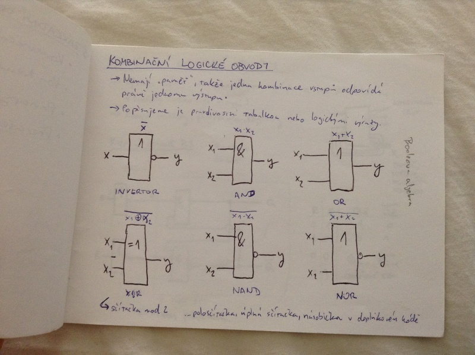
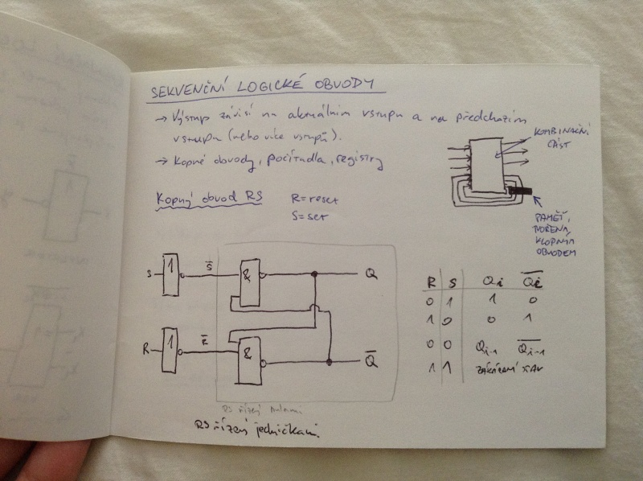
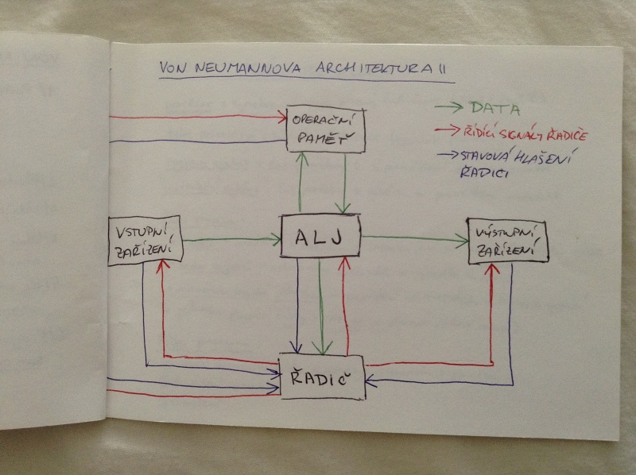
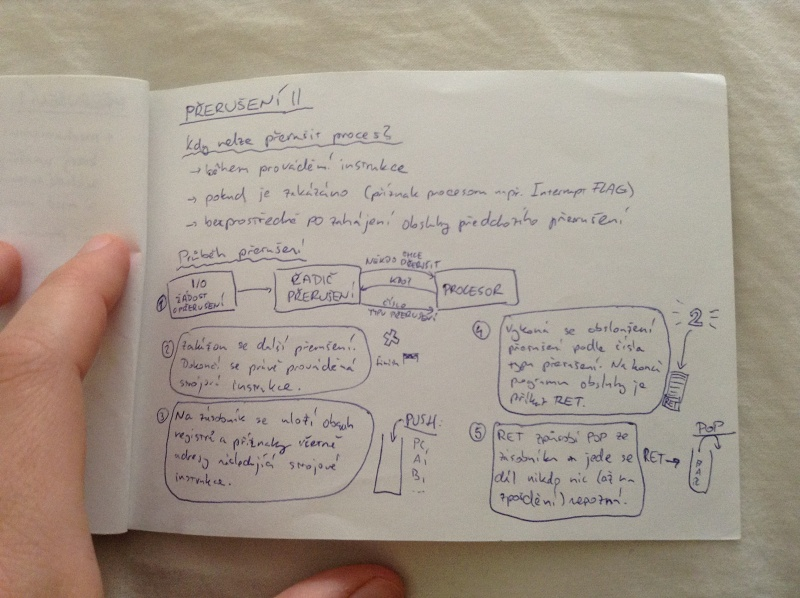

# Základní principy počítačů II.
- kombinační a sekvenční logické obvody
- Von Neumannova architektura
- principy práce procesoru
- přerušení

## Kombinační logické obvody
- nemají „paměť“, takže jedna kombinace vstupů odpovídá právě jednomu výstupu
- popisujeme je pravdivostní tabulkou nebo logickými výrazy

## Sekvenční logické obvody
- výstpu závisí na aktuálním vstupu a na předchozím vstupu (nebo výce vstupů)
- klopné obvody, počítadla, registry

### Klopný obvod RS (reset, set)

## Von Neumannova architektura
1. počítač obsahuje
    - operační paměť
    - aritmeticko-logickou jednotku
    - řadič
    - vstupně/výstupní zařízení
2. předpis pro řešení úlohy je tvořený posloupností instrukcí
3. údaje a instrukce jsou vyjádřeny binárně
4. údaje a instrukce se uchovávají v paměti na místech označených adresami
5. ke změně pořadí prováděných instrukcí použijeme instrukce podmíněného a nepodmíněného skoku
6. programem řízené zpracování dat probíhá v počítači samočinně

## Principy práce procesoru
_procesor_ = synchronní stroj řízený řadičem (ALJ + řadič)

_takt procesoru_ = základní frekvence (rychlost procesoru)

_strojový cyklus_ = čas potřebný k zápisu/čtení slova z paměti

_instrukční cyklus_ = čas potřebný k výběru a provedení instrukce

### Části procesoru
- řadič - načítání a dekódování instrukcí, načítání operandů, ukádání výsledků
- sada registrů - uchovávání operandů a výsledků
- aritmeticko-logická jednotka - provádění aritmetickcých a logických operací
- (jednotka plovoucí čárky - operace v plovoucí řádové čárce)

### Fáze procesoru
1. výběr operačního kódu a adresy operandu z paměti
2. provedení instrukce
3. přerušení

## Přerušení
= mechanismus pro asynchronní obsluhu událostí, který umožňuje pozastavit vykonávaný proces na základě externí příčiny, uložit si stav, zapamatovat si místo návratu a potom se k procesu znovu vrátit

např. přerušení od časovače (proces běží dlouho, měl by se vyměnit)

_vnější přerušení_ = vyvolává je I/O zařízení, které si tak vyžaduje pozornost - chce obsloužit (přesunout data apod.)

_vnitřní přerušení_ = vyvolává je sám procesor, pokud dojde k nějaké chybě (dělení nulou, výpadek stránky, přístup na špatné místo v paměti)

_řadič přerušení_ - speciální obvod, který dokáže určit prioritu jednotlivých přerušení

_softwarové přerušení_ - synchronní, je to speciální strojová instrukce, která se používá pro systémová volání, nachází se přímo v programu

### Kdy nelze přerušit proces?
- během provádění instrukce
- pokud je zakázáno (příznak procesoru např. Interrupt FLAG)
- bezprostředně po zahájení obsluhy předchozího přerušení

### Průběh přerušení

