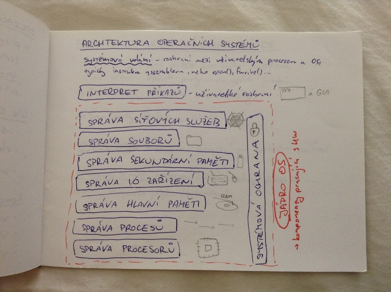
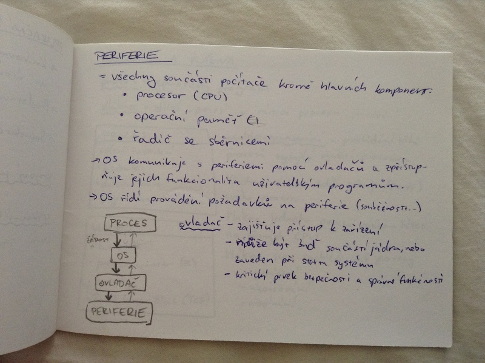

# Operační systémy
- architektury operačních systémů
- aplikační programovací rozhraní
- periferie
    - správa
    - ovladače
- procesy a vlákna
- synchronizace procesů a vláken

## Operační systém
= program, který řídí a spravuje prostředky počítače (CPU, operační pamět, disková paměť, I/O zařízení) a koordinuje spouštění programů a zabraňuje chybám a vzájemného ovlivňování

### Cíle OS:
- uživatelská přívětivost
- efektivní využití zdrojů
- snadná rozšiřitelnost, testování a vývor

### Komponenty OS:
- správa procesů
- správa operační paměti
- správa souborů
- správa I/O zařízení
- správa sekundárních pamětí
- správa síťových služeb
- ochranný systém
- interpreti příkazů (shell)

## Architektura operačních systémů
_systémová volání_ - rozhraní mezi uživatelským procesem a OS, typicky instrukce assembleru , nebo open, fwrite, ...

## Aplikační programovací rozhraní OS
- knihovny volání služeb operačního systému na úrovni vyšších programovacích jazyků
- představuje abstrakci volané služby
- standardy POSIX a Win32

_strojový jazyk_ - soubor instrukcí pro konkrétní počítač

_aplikační binární rozhraní_ (ABI) - volání služeb OS na úrovni strojového jazyka (assembleru)

## Periferie
= všechny součásti počítače kromě hlavních komponent:

    - procesor
    - operační paměť
    - řadič se sběrnicemi

- OS komunikuje s periferiemi pomocí ovladačů a zpřístupňuje jejich funkcionalitu uživatelským programům
- OS řídí provádění požadavků na periferie (souběžnosti)

_ovladač_

- zajišťuje přístup k zařízení
- může být buď součástí jádra, nebo zaveden při stavu systému
- kritický prvek budoučnosti a správné funkčnosti

## Procesy a vlákna
_proces_ = spuštěný program

_vlákno_ = dílčí proces v rámci procesu

### Proces
- čítač instrukcí
- zásobník
- datová sekce
- program (instrukční sekce)

### Vlákno
- zásobník
- program counter (PC)
- registry
- Thread Context Block (TCB)

_multiprogramování_ - pokládání běhů procesů zvyšující využití procesu

Všechna vlánka sdílí zdroje (paměť) svého procesu.

Vlánka jednoho procesu mohou běžet na různých CPU.

Vlákna jsou rychlejší než procesy.

- vytváření
- ukončování
- přepínání

## Jednovláknový / multivláknový OS

### Jednovlánkový OS
- nepodporuje koncept vláken
- MS-DOS

### Multivláknový OS
- podporuje koncept vláken
- Windows XP, Solaris

## Synchronizace procesů
Jeden proces čeká na událost druhého procesu.

_uváznutí_ - každý proces čeká na zprávu od jiného procesu

_stárnutí_ - dva procesy si posílají zprávy a třetí čeká

Sdílení prostředků (zápis-zápis, zápis-čtení).

_kritická sekce_ - označení části kódu, kde se přistupuje ke sdílenému prostředku

_race condition_ (souběh) - nevíme, který proces přistoupí ke zdroji dřív -> nutnost synchronizace

## Problém kritické sekce

### Podmínky
- vzájemné vyloučení -> bezpečnost
    - kritickou sekci může provádět jen jeden proces
- trvalost postupu -> živost
    - výběr procesu, který vstoupí do kritické sekce nesmí trvat nekonečně dlouho
- konečnost doby čekání -> spravedlnost
    - rozhodnutí o vstupu do kritické sekce nesmí být pro nějaký proces odkládáno do nekonečna

### Řešení
- SW - aktivní čekání
- HS - speciální instrukce procesoru, aktivní čekání (Petersonův algoritmus)
- OS - pasivní čekání, semafory, monitory, zasílání zpráv

## Podmínky uváznutí
- nutné
    - vzájemné vyloučení
    - ponechání si zdroje a čekání na další
    - bez předbíhání
- postačující
    - kruhové čekání

## Způsoby synchronizace

### Aktivní čekání
- „už tam budem?“
- zbytečně spotřebovává čas CPU

### Pasivní čekání
- semafor
    - před vstupem do kritické sekce zjistí, jestli je čítač 0, pokud ano, čeká; pokud ne, sníží ho o jedna a vstupí
    - obecný - celočíselná hodnota, více zdrojů
    - binární - 0 nebo 1, nazší na implementaci
- monitor
    - snadno se používá, menší riziko chybovosti, vysokoúrovňový

