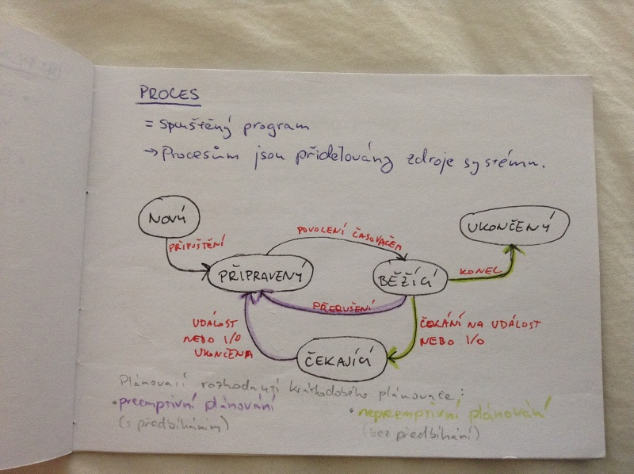

# Plánování procesů
- podstata a cíle plánování úloh v operačních systémech
- realizace plánování činností procesorů
- uváznutí
    - podmínky uváznutí
    - metody ochrany proti uváznutí

## Proces
= spuštěný program

Procesům jsou přidělovány zdroje systému.

## Fronty plánování procesů
- fronta úloh - všechny procesy v systému
- fronta připravencých procesů
- fronta na zařízení
- fronta odložených procesů
- fronta na semafor
- ...

Všechny proces, které chci spustit, nemusí být v operační pěmti. Fronta všech úloh může být velká, proto z ní plánovač vybírá pouze vybrané úlohy.

## Plánovače

### Strategický (dlouhodobý) plánovač
- rozhoduje, který proces bude spuštěn
- zařazuje procesy mezi připravené
- nemusí být příliš rychlý

### Krátkodobý plánovač (dispečer)
- z připravených procesů vybere další proces a přidělí CPU
- musí být velmi rychlý (plánuje na velmi malé časové sloty)

### Střednědobý (taktický) plánovač
- pokud je úloh moc, vyplatí se některé odložit na disk (pryč z CPU)
- dva nové stavy procesu: odložený čekající, odložený připravený

## Multiprogramování
- pokud nějaký proces čeká na dokončení I/O operace, může mezitím jiný proces využít procesor (CPU)
- zvyšujeme využití CPU
- kombiujeme procesy orientované na I/O a na využití CPU
- stupeň multiprogramování určuje strategický (dlouhodobý) plánovač

## Kritéria plánování
- maximalizovat:
    - využití CPU
    - propustnost - počet procesů, které dokončí svůj běh za jednotku času
- minimalizovat:
    - dobu obrátky - doba potřebná pro provedení konkrétního procesu
    - doba čekání - doba, kterou proces čeká ve frontě připravených procesů
    - doba odpovědi - čas mezi zadáním požadavku a první reakcí (nikoli celým výsledkem)

## Algoritmus FCFS (First comes, first served)

_konvojový efekt_ = po dlouhém procesu následuje několik krátkých a průměrná doba čekání narůstá; záleží na pořadí, ve kterém procesy přijdou

## Algoritmus SJF (shortest job first)
- vybírá procesy s nejkratším požadavkem na CPU

1. nepreemptivní - žádný proces nemůže předběhnout právě zpracovávaný proces
2. preemptivní - pokud se ve frontě připravených procesů objeví proces s kratším požadavkem, než potrvá dokončení právě zpracovávaného procesu, bude tento proces předběhnut

Délku příští dávky neznáme, odhadujeme ji na základě historie.

SJF je optimální, minimalizuje průměrnou dobu čekání.

## Prioritní plánování
- Každý proces má přidělené prioritní číslo.
- Většinou: čím nižší číslo, tím vyšší priorita.
- nepreemptivní i preemptivní varianta (viz SJF)
- SJF je druh prioritního plánování - prioritní číslo je délka dávky

_problém stárnutí_ = procesy s nízkou prioritou nepřijdou nikdy na řadu

řešení: _zrání_ = priorita se postupem času zvyšuje

## Round robin
- Každý proces dostane pevně přidělenou dobu procesu, která se odvíjí od počtu procesů ve frontě.

n procesů ve frontě -> 1/n doba procesoru pro každý proces

Po uplynutí času na proces se proces vrací na konec fronty připravených procesů.

## Uváznutí
- Skupina blokovaných procesů, kde každý čeká na zdroj držený jiným procesem z této skupiny.

_kruhové čekání_ (circular wait) - P1 čeká na P2 a P2 čeká na P1.

### Charakteristika (nutné požadavky)
- _vzájemné vyloučení_ (mutual exclusion) - zdroj může naráz používat jen jeden proces
- _ponechání si zdroje a čekání na další_ (hold and wait)
- _bez předbíhání_ (no preemption) - nemůžeme nuceně uvolnit zdroje (předběhnutím)

Graf přidělených zdrojů (RAG resource-allocation graph): neobsahuje-li cyklus, k uváznutí nedošlo (pokud ano, záleží na počtu instancí zdroje)

## Ochrana proti uváznutí

### Prevence
_přímé metody_ - zneplatnění některé z podmínek

- vzájemné vyloučení - nesdílíme zdroje (např. virtualizace)
- požadování všech prostředků naráz - neefektivní (stárnutí)
- odebrání požadovaných prostředků ostatním procesům

_nepřímé metody_ - nepřipuštění cyků v RAG
- uspořádání pořadí vyžadovaných prostředků

### Obcházení
- dynamický algoritmus kontrolující možnost vzniku uváznutí
- pokud by mělo dojít k uváznutí, nepřidělí se prostředky

### Obnova po uváznutí
- povolíme uváznutí, detekujeme ho a aplikujeme plán obnovy
- postupně ukončujeme procesy, dokud neodstraníme cyklus v grafu

