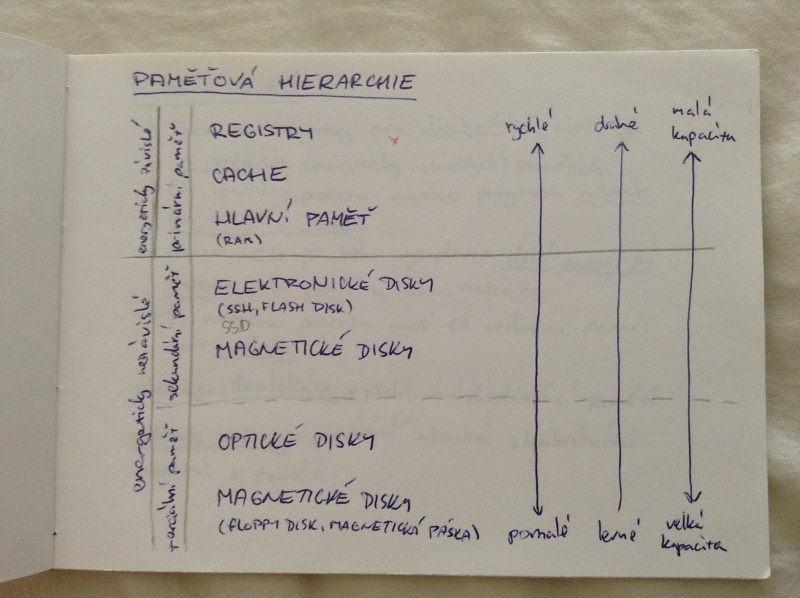
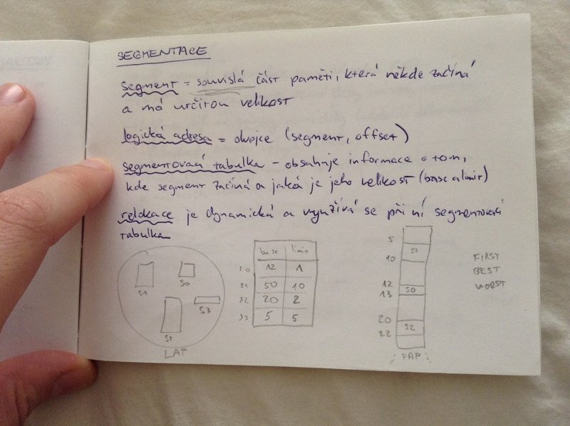
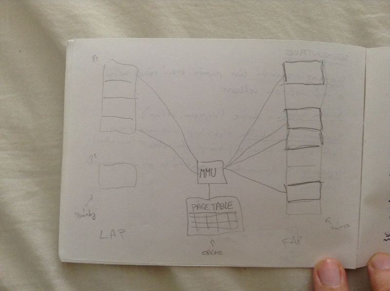

# Práce s pamětí
- paměťová hierarchie
- práce s pamětí
- logický a fyzický adresový prostor
- správa paměti
- virtualizace paměti
- segmentace
- stránkování

## Paměťová hierarchie

## Práce s pamětí
- data a programy jsou dlouhodobě uložený ve vnějších (energeticky nezávislých) pamětích
- při spouštění procesu musíme program nahrát do operační paměti
- proces může při běhu vyžadovat další paměť pro data a tuto paměť za běhu vracet operačnímu systému
- po ukončení procesu musí operační systém veškerou paměť opět uvolnit

_alokace, dealokace_ = pridělování/uvolňování paměti

_address binding_ = provázání instrukcí s konkrétními adresami v paměti

## Adresový prostor

### Fyzický adresový prostor (reálný)
- určen škálou adres hlavní paměti
- linární, jednodimenzionální
- fyzická adresa (reálná adresa)
- adresa fyzického adresového prostoru je akceptována operační pamětí

### Logický adresový prostor (viruální)
- generuje ji CPU
- logická adresa je dána adresou ve strojovém jazyce
- jednodimenzionální nebo dvoudimenzionální

_relokační registr_ převádí logickou adresu na fyzickou

## Vázání adres LAP na FAP
- při kompilaci
    - LAP a FAP se chodují
    - umístění v paměti musí být známo předem
    - při změně umístění je nutné program znovu zkompilovat
- při zavádění
    - LAP a FAP se shodují
    - v době kompilace není umístění známe
    - generuje se přemístitelný kód
- za běhu
    - LAP a FAP mohou být rozdílené
    - uplatňuje se abstrakce adresového prostoru

## Přidelnování paměti
- first-fit
    - přidělí první dostatečně dlouhou oblast
- best-fit
    - přidělí nejmenší dostatečně dlouhou oblast
    - generuje nejmenší monžé volné díry
- worst fit
    - přidělí největší ddostatečně velkou oblast
    - generuje největší možné díry

_vnější fragmentace_ = souhrn volné paměti je dostatečný, ale ne v dostatené souvislé oblasti (pomáhá defragmentace = setřesení)

_vnitřní fragmentace_ = proces nevyužívá celý přidělený prostro

## Požadavky na správu paměti
- ochrana - proces nesmí bez povolení odkazovat na místa FAP jiných procesů
- sdílení - více procesů může řízeně používat stejnou částu FAP (je to lepší než udržování konzistence kopií)
- logická organizace struktur programu - programy tvoří moduly s různými vlastnostmi, operační systém a hardware musí zaručit předchozí dvě podmínky i pro moduly
    - execute-only, read-only, read, write, ...
    - private/public

## Virtualizace paměti
- paměť, kterou má běžící proces k dispozici, není omezena fyzickou velikostí paměti (LAP ≥ FAP)
- implementujeme ji pomocí stránkování na žádost nebo segmentování na žádost
- ve FAP se mohou nahcázet pouze části programů nutné pro bezprostřední řízení procesů
- umožňuje udržovat více procesů ve FAP ->  větší pravděpodobnost, že bude nějaký připravený
- nutná podpora harware
- separace LAP a FAP
- adresové prostory lze sdílet mezi procesy
- lze efektivněji vytvářet procesy

## Segmentace
_segment_ = souvislá část paměti, která někde začíná a má určitou velikost

_logická adresa_ = dvojice (segment, offset)

_segmentovací tabulka_ - obsahuje informace o tom, kde segment začíná a ajká je jeho velikost (base a limit)

_relokace_ je dynamická a využívá se při ní segmentovací tabulka

## Stránkování
- LAP menusí odpovídat souvislé sekci FAP
- FAP se dělí na rámce pevné délky (násobky mocnin 2)
- LAP se dělí na stránky pevné délky (odpovídá délce rámců)
- udržujeme seznam volných rámců
- vzniká vnitřní fragmentace (paměť je CPU přidělována v násobncích velikost rámce)
- program déky n stránek se zavede do n rámců

_tabulka stránek_ - uložena v operační paměti, počátek odkazován registrem, zpřístupnění údajů býva řešení chache pamětí (vyžaduje dva přístupy)

_sdílení stránek_ - kód je v paměti uložen pouze jedenkrát

## Výpadek stránky
- pokud není potřebná stránka ve FAP, nastává výpadek stránky
- musíme stránku zavést do FAP: potřebujeme volný rámec
- algoritmy pro určení oběti:
    - FIFO - first in, first out
    - LRU - least recently used

_druhá šance_ - FIFO, z výběru se vynechává alespoň jedenkrát navštívená stránka z od posledního výběru

_optimální algoritmus_ - obětí je nejpozdější ze všech následujících odkazů na stránku (musíme znát budoucnost)