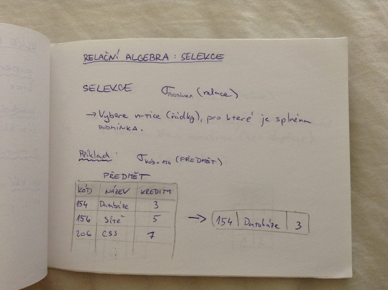
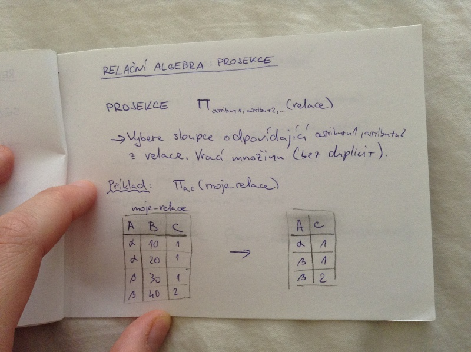
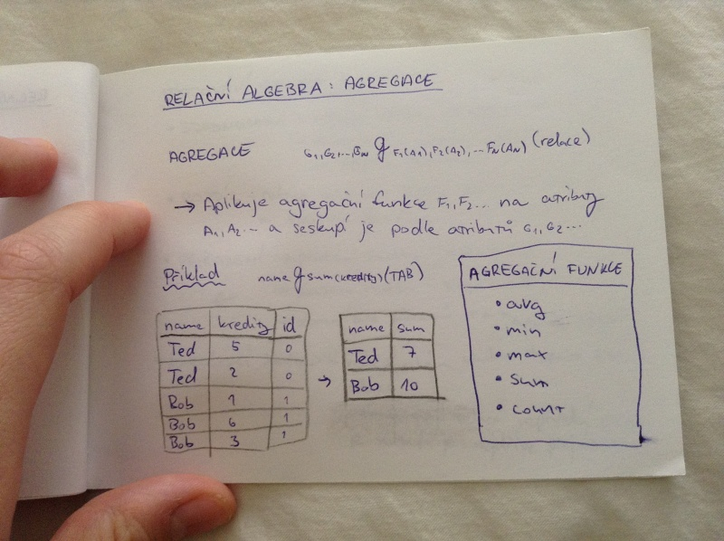

# Databáze I.
- relační model dat
- relační schéma
- klíče relačních schémat
- relační algebra
    - projekce
    - selekce
    - agregace
    - přejmenování
- spojení relací

## Datové modely
= kolekce nástrojů sloužících k popisu dat, jejich vzathů, sémantik a omezení

- relační model
- model entit a vztahů
- objektově orientovaný model
- semistrukturovaný model (XML)
- ...

## Relační model dat

_atribut_ = definován jménem a doménou; „sloupec tabulky“

_doména_ = množina povolených hodnot atributu

_schéma_ = neprázdná uspořádaná n-tice atributů; „záhlaví tabulky“

_relace_ = podmnožina kartézského součinu domén atributů, které tvoří schéma dané relace; množina n-tic; „celá tabulka“

_uspořádaná n-tice_ = „řádek v tabulce“, prvek relace

_null_ = speciální prázdná hodnota atributu

_databáze_ = soubor relací

## Klíče relačních schémat

_superklíč_ = libovolná podmnožina atributů, které unikátně identifikují každou entitu

_kandidátní klíč_ = neredundantní superklíč - každá část klíče je nezbytná pro unikátní identifikaci

_primární klíč_ = jeden vybraný kandidátní klíč

_cizí klíč_ = atribut, který nabývá hodnoty primárního klíče jiné relace (nebo může být NULL)

## Relační algebra: selekce

SELEKCE σ_podmínka(relace)

- vybere n-tice (řádky), pro které je splněna podmínka

Příklad:

## Relační algebra: projekce

PROJEKCE Φ_atribut1, atribut2 (relace)

- vybere sloupce odpovídající atributu1, atributu2 z relace. Vrací množinu (bez duplicit).

Příklad:

## Relační algebra: přejmenování

PŘEJMENOVÁNÍ \ro_noveJmenoRelace(stareJmenoRelace) \ro_×(A1, A2, ..., AN)(stareJmenoRelace)

- umožňuje přistupovat k jedné relaci pod více jmény
- umožní přejmenování atributů

_konstantní relace:_ \ro_predmety(uco, kod){(123, PB156), (456, VB001)}

## Relační algebra: agregace

AGREGACE G1,G2,...,GN_G_F1(A1),F2(A2),...,FN(AN)(relace)

- aplikuje agregační funkce F1, F2, ... na atributy A1, A2 ... a seskupí je podle atributů G1, G2, ...

Příklad:

## Spojování relací
- sjednocení ∪
    - relační schéma se přebírá z první relace
    - relace musí mít stejný počet atributů a stejnou doménu
- rozdíl -
    - relace musí mít stejný počet atributů a stejnou doménu
- přiřazení <-
    - přidání řádku: r <- r ∪ E
    - smazání řádku: r <- r - E
    - aktualizace záznamů r <- Φ_E1,E2,...,EN(relace)
- kartézský součin ×
    - relační schéma vznikne slepením 1. a 2. relace
    - pokud mají relace neprázdný průnik, je nutné je nejdříve přejmenovat
- přirozené vnitřní spojení ⋈
    - spojení přes stejné hodnoty
    - to, co je stejné se ve výsledku objeví jen jedenkrát
    - pokud neexistuje společný atribut, chová se jako ×
- přirozené vnější spojení
    - rozšíření přirozeného vnitřního spojení, které předchází ztrátě informací
    - chybějící pole zaplní NULL
- pravé přirozené vnější spojení
    - z pravé relace bere vše
- levé přirozené vnější spojení
    - z levé relace bere vše

