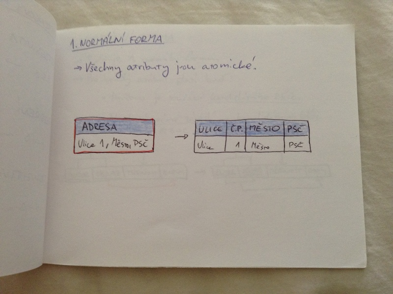
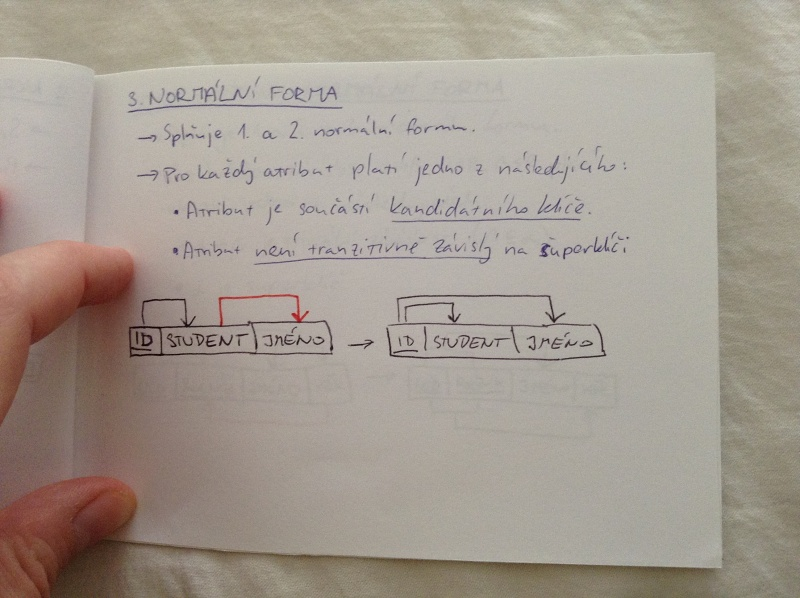
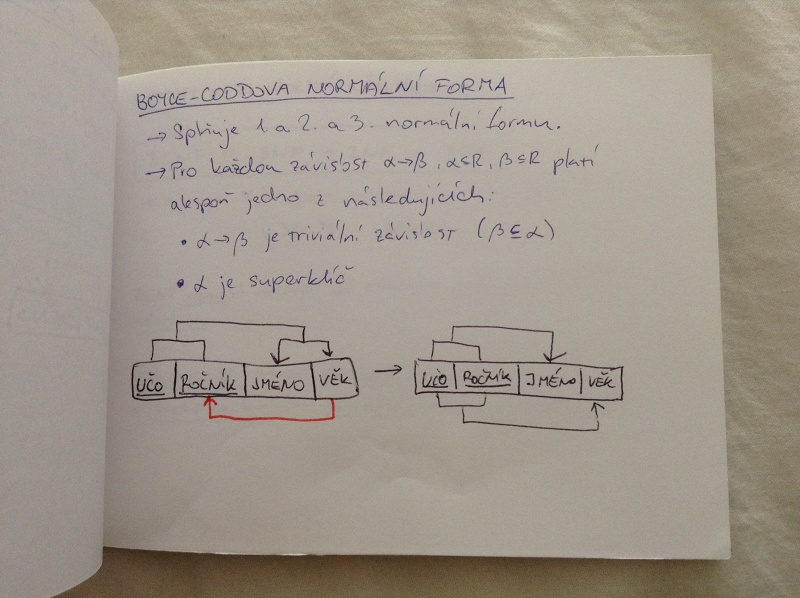

# Databáze II.
- funkční závislosti
- normální formy
    - 1. NF
    - 2. NF
    - 3. NF
    - Boyce-Codddova NF
- vztahy mezi normálními formami
- dekompozice relačních schémat
- normalizace schématu

## Funkční závislosti
= hodnota určité množiny atributů jednoznačně určuje hodnotu jiné množiny atributů

R...relační schéma, α ⊂ R, β ⊂ R : α -> β je funkční závislost pokud t_1[α] = t_2[α] ⇒ t_1[β] = \t_2[β]

_triviální funkční závislost_ : X ⊂ Y, Y -> X

_superklíč_ relace R je K, pokud K -> R

_kandidátní klíč_ relace R je K, pokud platí K -> R a α ⊂ K, α -> R

Funkční závislosti využíváme k testování relace nebo specifikace omezení.

_úplná funkční závislost_ : X -> Y, kde Y není závislé na jiné podmnožině X (částečně závislý)

## Armstrongovy axiomy
- reflexivita
    - β ⊂ α -> α -> β
- rozšíření
    - α -> β ⇒ α, γ -> β, γ
- tranzitivita
    - α -> β a β -> γ ⇒ α -> γ

## 1. normální forma
- všechny atributy jsou atomické

## 2. normální forma
- splňuje 1. normální formu
- pro každý atribut platí buď:
    - atribut je součástí kandidátního klíče
    - není částečně závily na kandidátním klíči

## 3. normální forma
- splňuje 1. a 2. normální formu
- pro každý atribut platí jedno z následujících:
    - atribut je součástí kandidátního klíče
    - atribut není tranzitivně závisly na superklíči

## Boyce-Coddova normální forma
- splňuje 1., 2. a 3. normální formu
- pro každou závislost α -> β, α ⊂ R, β ⊂ R platí alespoň jedno z následujících:
    - α -> β je triviální závislost (β ⊂ α)
    - α je superklíč

## Vztahy mezi normálními formami

BCNF ⊃ 3NF ⊃ 2NF ⊃ 1NF

třída relací X je vlastní podmnožinou třídy relací Y (X ⊃ Y . X ≠ Y)

BCNF nemusí na rozdíl od ostatních zachovávat funkční závislosti.

Vždy existuje pevod do 3NF takový, že je bezztrátový a zachová funkční závislosti (který využívá dekompozici).

## Dekompozice relačních schémat
= rozklad na více relačních schémat

### Bezztrátová dekompozice
- všechny atributy původních schématu se objeví i v rozkladu.
- R = R_1 ∪ R_2, Φ_A,B(r) ⋈ Φ_B,C(r)

### Dekompozice zachovávající funkční závislosti
- sjednocení všech funkčních závislostí z dekomponovaných schémat dá původní funkční závislosti originálního schématu
- pokud ne, musíme relace při každé modifikaci spojit ⋈ a ověriž platnost závislostí

## Normalizace
- proces dekompozice a reorganizace relačního schématu tak, aaby se s ním lépe pracovalo
    - omezení redundance
    - zlepšení konzistence
- nevede k navýšení výkonu databáze
- neexistuje jen jedno správné řešení

### Normální formy
- 1. NF - atributy jsou atomické
- 2. NF - neklíčové atributy jsou závislé (plně) na každém klíči
- 3. NF - neklíčové atributy jsou vzájemně nezávislé
- BCNF - atributy primárního klíče jsou vzájemně nezávislé