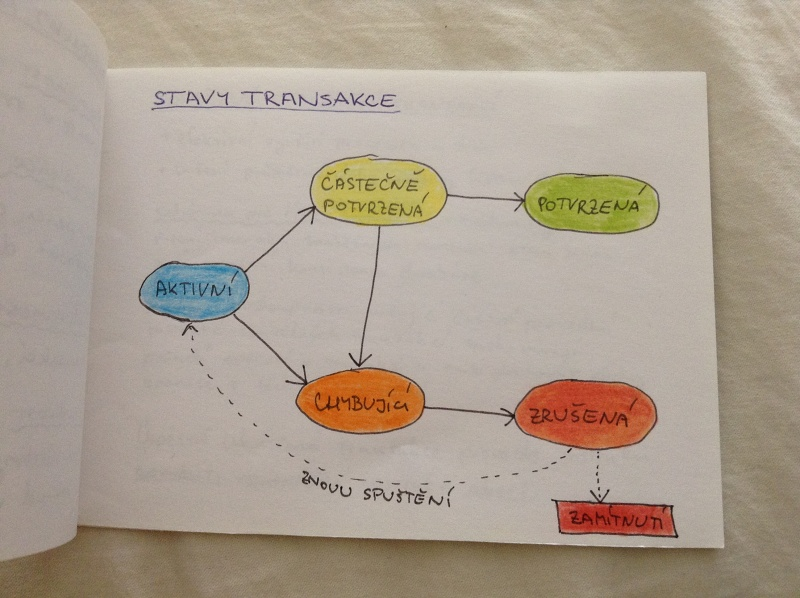
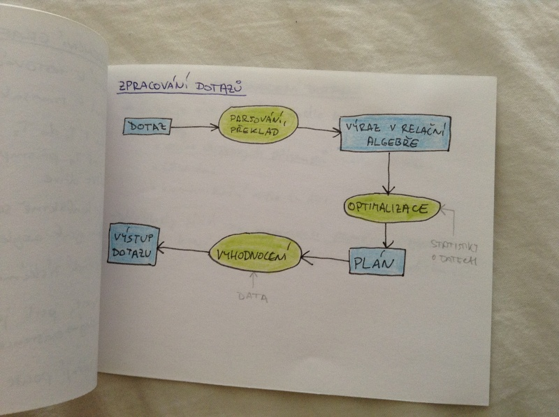

# Transakce a zpracování dotazů

- transakční zpracování a jeho vlastnosti
- základní principy vyhodnocování dotazů
    - náklady na vyhodnocení dotazu
    - využití indexování a hashování

## Transakce
_transakce_ = celek z vyhodnocování programu, který přistupuje a případně mění různá data

Příklad: převod 1000 Kč z účtu A na účet B

_Možné problémy:_

1. selhání hadware nebo software
2. souběžné vykonání více transakcí

## Požadavky na transakce (ACID)
-> zajištění integrity

_atomičnost_ - buď jsou vykonány všechny operace v transakci, nebo žádná z nich

_konzistence_ - provedení transakce zachová konzistenci databáze, v průběhu mohou vzniknout dočasné nekonzistentní stavy

_izolovanost_ - je povolen paralelní běh více transakcí, ale mezivýsledky musí být privání

_trvanlivost_ - po ukončení (úspěšném) transakce jsou všechny provedené změny uchovány i pokud nastane výpadek systému

## Stavy transakce

## Souběžné spouštění transakcí

- výhody:
    - efektivní využití procesoru a disku
    - snížení průměrné doby odezvy (čekací doba)

_schémata pro řízení souběžnosti_ = mechanismy pro řízení interackí souběžných transakcí, která zamezují porušení konzistence databáze

_plány_ = posloupnosti určující časové provedení instrukcí souběžných transakcí, zachovávají pořadí operací v transakci a musí obsahovat všechny operace z těchto transakcí

Úspěšně ukončená transakce provede instrukci _commit_, neúspěšná instrukci _abort_.

## Serializovatelnost
Plán je serializovatelný, pokud je ekvivalentní sériovému plánu.

### Konfliktí serializovatelnost
Instrukce jsou v konfliktu, pokud alespoň jedna z nich zapisuje na místo, kam obě přistupují. Plán je serializovatelný podle konfliktu, pokud můžeme prohodit nekonfliktní instrukce tak, aby byly transakce provedeny po sobě (sériově).

### Pohledová serializovatelnost
Plán je pohledově serializovatelný pokud je pohledově ekvivalentní sériovému plánu. Tedy v obou těchto plánech nastává nebo nenastává četní počáteční hodnoty, poslední zapsání stejné položky a čtení položky, které je výsledkem jiné transakce.

## Precedenční graf
- slouží k testování serializovatelnosti
- vrchol = transakce
- hrana z T1 do T2 = konflikt transakcí T1 a T2, přičemž T1 přistupuje k datům způsobující konflikt dříve

Plán je konfliktně serializovatelný, pokud je precedenční graf acyklicyý (o(n^2)).

Sériové pořadí získáme topologickým uspořádání.

Problém zjistit, jestli je plán pohledově serializovatelný, je NP-úplný -> existence efektivního algoritmu je nepravděpodobná.

Algoritmy ověřují pouze některé podmínky.

## Zpracování dotazů

## Náklady na vyhodnocení dotazu
- Existuje více kritérií, podle kterých lze měřit náklady:
    - počet diskových přístupů (snadno měřitelné)
    - CPU čas
    - komunikační režie (u distribuovaných a paralelních systémů)
- Náklady závisí na vyrovnávací paměti v operační paměti, které snižuje náklady na čtení z disku.

## Využití indexování
- Pokud vytvoříme index relace, můžeme ho potom využít ke čtení relace v uspořádaném pořadí
- Pro vytvoření indexu využíváme externí merge sort (pro relace, které se nevejdou celé do paměti, jinak můžeme vyižít quick sort)

## Využití hashování
- Využívá se při spojování relací.
- Hashovací funkce je použita pro rozdělení do množin, které mají stejnou hodnotu na spojovaných atributech.

