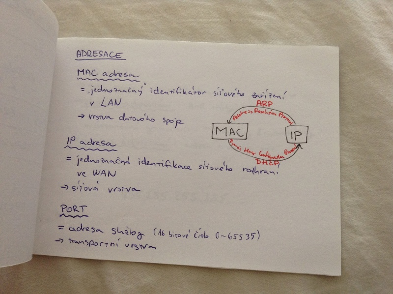

# Počítačové sítě I.
- modely vrstev počítačových sítí
    - ISO/OSI
    - TCP/IP
    - funkcionalita vrstev
    - součinnost vrstev
    - adreasace
- fyzická vrstva
    - signály a jejich kódování
    - řízení přístupu k médiu

## ISO/OSI model

| vrstva            | funkce | konverze | protokoly |
|-------------------|--------|-----------|----------|
| fyzická           | přenos bitů mezi odesílatelem a příjemcem, řízení dějů v přenosovém médiu | bity <-> signály | ALOHA |
| datového spoje    | zaručuje spolehlivost, brání zahlcení, detekuje chyby, řídí přístup k médiu | rámce <-> pakety | |
| síťová            | tvorba paketů, fragmentace, IP adresace, směrování, mapování IP <-> MAC, monitoring, propojování fyzických sítí | | IPv4, IPv6 |
| transportntí      | QoS, adresace portů, zajišťuje spolehlivost, poskytuje logický kanál |  data <-> pakety |TCP |
| relační           | správa relací (spojení mezi dvěma koncovými účastníky), synchronizace | | SSL |
| prezentační       | renvertuje data do jednotného formátu, šifrování, komprese | | ASCII |
| aplikační         | poskytuje rozhraní uživateli | | PGP |

## TCP/IP model

| TCP/IP vrstva                 | ekvivalent v ISO/OSI |
|-------------------------------|----------------------|
| vrstva přístupu k síti        | fyzická + datového spoje |
| síťová (internetová) vrstva   | síťová |
| transportní vrstva            | transportní |
| aplikační vrstva              | relační + prezentační + aplikační |

## Adresace

### MAC adresa
= jednoznačný identifikátor síťového zařízení v LAN, vrstva datového spoje

### IP adresa
= jednoznačná identifikace síťového rozhraní ve WAN, síťová vrstva

### Port
= adresa služby (16bitové číslo 0-65535), transporntí vrstva

## IPv4
- 32 bitů
- typy adres: unicast, broadcast, multicast
- classfull adresování: A-E třídy
    - nedosatečná granularita -> subnetting a supernetting
- classless adresování: adresa a maska sítě

255.255.255.255

## IPv6
- 128 bitů
- typy adres: unicast, multicast, anycast
- zkracování zápicu: vynechání levých nul, vynechání bloku obsahujícího jen nuly
- podpora zabezpečení - IPSec (AH + ESP) autentizace i šifrování, správa šifrovacích klíčů
- nepodporuje fragmentaci, nastane chyba a data se musí rozdělit do více paketů
- podpora mobility a real-time přenosů

2001:0db8:85a3:08d3:1319:8a2e:0370:7344

## Signály
- data jsou přenásena pomocí signálů, je nutné je převést z binárních dat na signály

_signál_ = časová funkce reprezentující změny fyzikálních vlastnosti přenosového média

- analogový signál - spojitý v čase, šíří se po vodiči i bezdrátově
- digitální signál - nespojitý v čase, šíří se pouze po vodiči

_defekty signálů_:

- slábnutí
- zkreslení
- šum

## Kódování signálů

- převod binárních dat na signál
- problém: synchronizace vysílače a přijímače

### Přímé kódování
- 0 je 0 a 1 je 1
- bez možnosti synchronizace

### NRZ kódování (Not return to zero)
- pokud je násleující bit 1, změní amplitudu

### Manchester kódování
- každý bit je kódován dvěma prvky signálu

### Kódování 4B/5B
- mapuje čtyři bity na speciální pětibitové vzorky
- maximálně tři nuly po sobě + NRZ kódování (ošetří 1)

## Řízení přístupu k médiu
- cíl: eliminovat kolize

1. neřízený přístup
    - Aloha
        - vysílá, kdy chce
        - při kolizi náhodou dobu počká a zkusí to znova
    - CMSA/CD (carrier sense multiple access with collision detection)
        - před vysíláním zjistí, jestli je médium volné
        - při kolizi náhodnou dobu počká a zkusí to znova
        - pouze u voděných médií
    - CMSA/CA (carrier sense multiple access with collision avoidance)
        - v nevoděných médiích
        - doba čekání se při neúspěšných pokusech exponenciálně zvětšuje
2. řízený přístup - stanice smí vysílat, pouze když získá svolení
    - rezervace
    - vyzývání
    - předávání příznaku (pešek)
3. multiplexově orientovaný přístup - médiu se přenáší více signálů naráz
    - FDMA (frequency division multiple accross)
        - různá frekvenční pásma
    - TDMA (time division multiple access)
        - několik časových slotů
