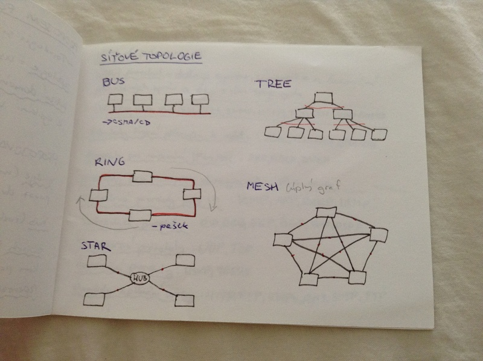
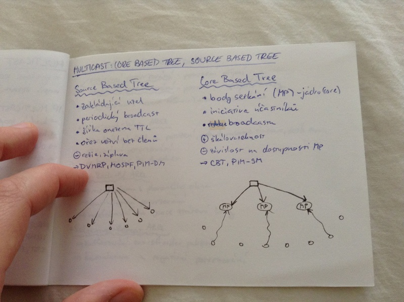
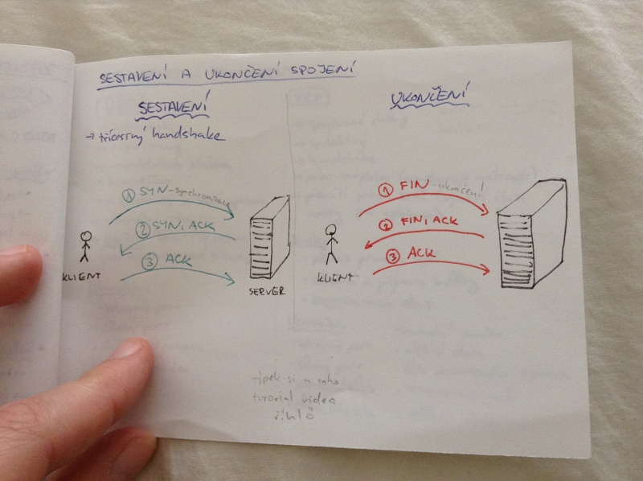

# Počítačové sítě II.
- propojování počítačových sítí
- síťové protokoly
- přepínání a směrování
- multicast
- zajištěný přenos dat
- sestavení a ukončení spojení
- transportní protokoly

## Propojení počítačových sítí
- Topologii sítě řešíme ve vrstvě datového spoje.

_topologie_ = uspořádání stanic na médiu

_kolizní doména_ skupina stanic, ve které když dojde k vysílání více stanic, dojde ke kolizi

### Propojovací zařízení v LAN:

_bridge_ (můstek) - spojuje dvě části sítě a odděluje provoz dvou podsítí

_hub_ (rozbočovač) - umožňuje větvení

_switch_ (přepínač) - rozbočovač, který posílá data jen tam, kam patří

_repeater (opakovač) - přeposílá zesílený signál

## Síťové topologie

## Síťové protokoly

_síťové protokoly_ = definuje syntex, sémantiku a časování přenášených zpráv a akcí s tím spojených

UDP, TCP, IPv4, IPv6, SSL, TLS, SNMP, HTTP, FTP, SSA, ALOHA, CSMA/CD

_protokoly řízení přístupu k médiu_: Aloha, CSMA/CA, CSMA/CD

_protokoly pro mapování IP <-> MAC: ARP, RARP, DHCP

_protokoly pro transport datagramů_: IPv4, IPv6

_podpůrné protokoly pro IP_: ICMP (zprávy), ARP, RARP (address resolution), IGMP (multicast)

_směrovací protokoly_: RIP, EIGRP, EGP, BGP, IStS, OSPF

_transportní protokoly_: UDP, TCP

_rezervační protokoly_: RSVP, YESSIR

_protokoly aplikační vrstvy_: HTTP, FTP, IMAP4, POP3, SMTP, FTP

## Přepínání a směrování

### Spojované sítě (stavové)
- přepínání okruhů
- před začátkem vysílání je vytvořeno spojení (okruh), které je udržováno po celou dobu komunikace
- snadná implementace
- okruh může být pevný, nebo vytvořený na přání
- např. analogové telefonní sítě

### Nespojované sítě
- směrování paketů
- data jsou rozdělena na více částí a v každém uzlu sítě je rozhodováno, kam se pošlou dál (blíž k cíli)
- není nutné uchovávat stav sítě
- složitější implementace
- např. Internet

## Multicast
= vysílání jedné zprávy více příjemcům (např. stream videa, videokonference)

IP multicast
- každým spojem jde maximálně jedna kopie dat
- hop-by-hop
- doručení nezaručeno
- rozah šíření omezen TTL
- multicastová adresa
- výhoda: škálovatelnost, nezatěžuje síť kopiemi
- nevýhoda: komplikované účtování, nezaručené doručení, terč DDoS útoků

Protokoly: IGMP, DVMRD, MOSDD, PIM-DM, CBT, PIM-SM

## Multicast: core-based tree, source based tree

### Source based tree
- zakládající uzel
- periodický broadcast
- šířka omezena TTL
- ořez větví bez členů
- nevýhoda: režie, záplava
- DVMRP, MOSPF, PIM-DM

### Core Based Tree
- body setkání (MP) - jádor (core)
- iniciativa účasstníků
- redukce proadcastu
- výhoda: škálovatelnost
- nevýhoda: závislost na dostupnosti MP
- CBT, PIM-SM

Ilustrační obárzek:

## Zajištění přenosu dat
- pozitivní potvrzování - potvrzení přijetí
- negativní potvrzování - potvrzení nepřijetí/ztráty

ARQ(automatic repeat reQuest) - znovuposlání dat

### Stop and wait ARQ
- odesílatel čeká na potvrzení, pokud nastane timeout, pošle znovu
- pozitvivní potvrzování
- lze posílat jen jeden paket

### Go-Back-N ARQ
- mechanismus plovoucího okna
- kumulativní potvrzování
- neefektivní pro vysoce ztrátové linky

### Selective-Repeat ARQ
- bufferování out-of-order packetů
- kumulativní a negativní potvrzování

## Sestavení a ukončení spojení

## Transportní protokoly

### UDP
- jednoduchý
- nespojovaný
- nespolehlivá služba
- best-efford
- o spolehlivost se stará aplikace
- minimální režije
- využití: DNS, TFTP, realtime přenosy, multicastové přenosy
- hlavička
    - zdrojový port
    - cílový port
    - délka UDP paketu
    - kontrolní součet

### TCP
- spojované služby
- spolehlivé
- handshake
- point-to-point (nepodporuje multicast)
- přenásí proud bitů (vytvárí iluzi roury pro aplikace)
- služby
    - přenos proudu bytů
    - odesílací a přijímací bufery
    - segmentace dat
- hlavička
    - zdrojový port
    - cílový port
    - sekvenční číslo
    - délka hlavičky
    - kontrolní součet
    - řidicí data
    - číslo potvrzeného segmentu
    - rezervované pole
    - velikost okna
    - ...
