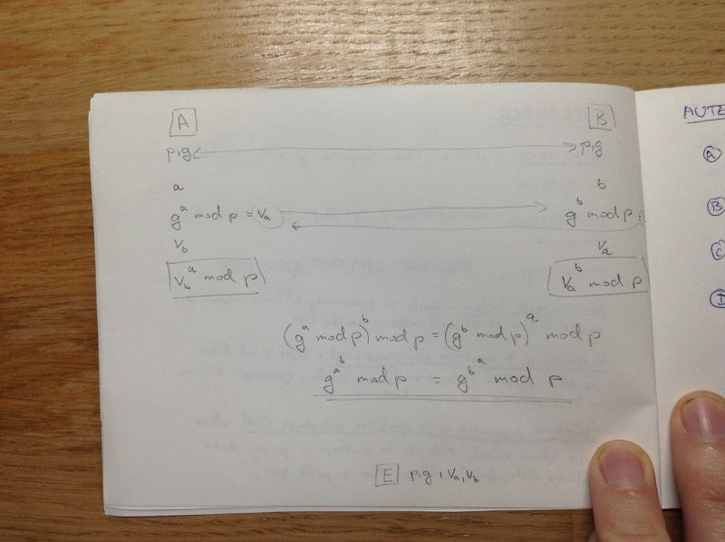

# Síťové aplikace a bezpečnost II.
- zabezpečení síťové komunikace
- autentizace
- šifrování
- zabezpečení na jednotlivých protokolových vrstvách

## Zabezpečení síťové komunikace
Bezpečná komunikační síť by měla nabíze tyto složky:

- AAA
    - authentization (autentizace)
    - authorization (autorizace)
    - accounting (účtování) = sledování využívání služeb uživeteli (správa, plánování, účtování, ...)
- Zabezpečená komunikace
    - důvěra
    - integrita
    - nepopiratelnost

Zabezpečení řeší kryptografie.

Jiný pohled:

- dostupnost
- spolehlivost
- zabezpečení
- důvěra
- integrita
- udržovatelnost

## Autentizace
= jedinec nebo skupina je tím, za koho se vydává

_autorizace_ = autentizovaný uživatel má přístup někam, pravomoce

Zajišťuje ji: IPSec (AH i ESP), PGP, RIPv2, OSPF

_Autentizace heslem_ - heslo je symetricky šifrováno, nemusí být čerstvé (uživatel ho mohl uložit) -> možný útok

_Autentizace s využitím náhodných čísel_ - Alice si od Boba nejdřív vyžádá číslo, které potom zašifruje symetrickým klíčem -> řeší problém čerstvosti hesla

_Vzájemná autentizace s využitím náhodných čísel_ - Alice pošle Bobovi náhodné číslo, ten ho zašifruje a připojí druhé náhodné číslo, které zašifruje Alice a pošle zpět

Ilustrační obrázek:

## Autentizace : zjišení identity

1. znalost - heslo, pin, username
2. vlastnictví - token, usb, privátní klíč
3. vlastnost - otisk prstu, sken sítnice
4. dovednost - odpovědět na náhodně vygenerovanou otáku

## Šifrování
- zajištění důvěrnosti přenosu
- využívá se symetrická kryptografie
- pro přenesení klíče se použije asymetrická krypografie (Diffie-Hellman)

_symetrické šifrování_

- šifrujeme i dešifrujeme stejným klíčem
- jeden soukromý klíč
- rychlejší
- AES, DES

_asymetrické šifrování_

- šifrujeme veřejným klíčem
- dešifrujeme soukromým klíčem
- pomalejší
- RSA, ElGamal, Diffie-Hellman

## Algoritmus Diffie-Hellman
- Umožňuje domluvit se na sdíleném tajném klíči před odposlouchané médium.
- Využívá těžkost výpočtu diskrétního logaritmu.

1. Alice a Bob se veřejně dohodnou na prvočíselném modulu p a primitivním kořenu g tohoto modulu.
2. Alice i Bob si zvolí soukromé náhodné číslo X a spočítájí g^x mod p a výsledek si pošlou.
3. Alice i Bob spočítají společný soukromý klíč tak, že umocní výsledek toho druhého na svůj soukromý klíč a vypočítají modulo p.

S dostatečně velkými čísly je nemožné komunikaci rozšifrovat v reálném čase.

## Digitální podpis
- založen na asymetrickém šifrování
- podepisujeme soukromým klíčem
- ověřujeme veřeným klíčem
- podepisuje se hash zprávy
- algoritmy: RSA, DSA
- v ČR certifikáty vystavuje: Česká pošta, První certivikační autorita, eIdentity

## Zabezpečení na síťové vrstvě

IPSec = kolekce protokolů zajišťující:

- AH (Authentication Header)
    - autentizace odesílatele
    - integrita
- ESP (Encapsulating security payload)
    - autentizace odesílatele
    - integrita
    - důvěrnost přenosu

Módy:
- _transparentní_ - IPSec hlavička se vloží mezi IP hlavičku a tělo zprávy
- _tunelovací_ - IPSec hlavička se vloží před IP hlavičku a vygeneruje se nová IP hlavička

- výhoda: zabezpečení zatových toků mezi uzly, netřeba upravenost aplikace
- nevýhoda: nemá automatizované prostředky pro správu klíčů

## Zabezpečení na transportní vrstvě
- Protokoly SSL (Secure socket layer) a TLS (transport layer security)
- při jejich použití nutné upravit protokoly na aplikační vrstvě
    - HTTP -> HTTPS
    - FTP -> FTPS

## Zabezpečení na aplikační vrstvě

### PGP (pretty good privacy)
= mechanismus pro zasílání bezpečné pošty

- důvěra přenosu
- integrita zpráv
- autentizace odesílatele
- nepopiratelnost

