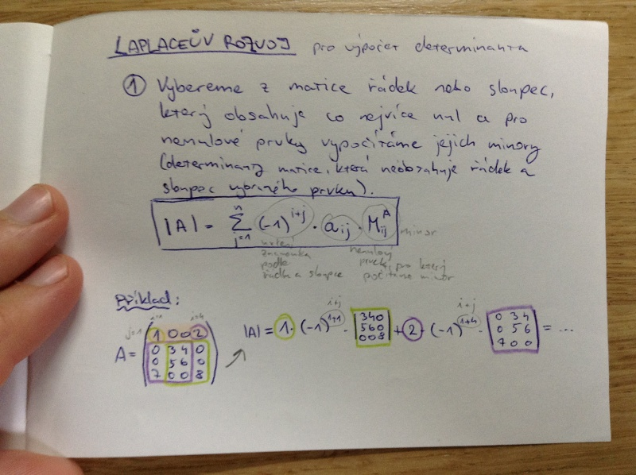

# Lineární algebra I.

- operace s vektory a maticemi
- vlastnosti lineárních operací
- vlastnosti skalárního součinu
- řešení systému lineárních rovnic
- Gaussova eliminace
- determinant

## Vektory
_vektor_ = uspořádáná n-tice skalárů 𝕂; n ∈ ℕ je pevně zvolené a nazýváme ho _dimenze_
_skalár_ = hodnota určená jedním číslem

### Sčítání vektorů
u + v = (a_1, ..., a_n) + (b_1, ..., b_2) = (a_1 + b_1, ..., a_n + b_n)

### Násobení vektoru skalárem
c ∙ u = c ∙ (a_1, ..., a_n) = (c ∙ a_1, ..., c ∙ a_n)

### Matice
_matice_ typu m|n nad skaláry 𝕂 je obdélníkové schéma A s m řádky a n sloupci, kde a_ij ∈ 𝕂 pro všechna 1 ≤ i ≤ m a 1 ≤ j ≤ n.

Vektroy (a_i1, a_i2, ..., a_in) ∈ 𝕂^n, i ≤ m jsou i-té _řádky_ A.

Vektory (a_1j, a_2j, ..., a_mj) ∈ 𝕂^m, j ≤ n jsou j-té _sloupce A.

Matice je zobrazení A : {1, ..., m} ⨯ {1, ..., n} -> 𝕂

## Speciální druhy matic
_nulová matice_ = obsahuje samé nuly

_čtvercová matice_ = m = n

_jednotková matice_ = čtvercová matice, která má na diagonále jedničky a všude jinde nuly

_opačná matice_ = po sečtení s maticí vyjde nulová matice

_schodovitá matice_ = každý řádek obsahující alespoň jedno číslo různé od nuly má na začátku víc nul než předchozí řádek; pokud má nulové řádky, jsou všechny na konci

_transponovaná matice_ = sloupce jsou řádky a řádky jsou sloupce

## Operace s maticemi

### Sčítání matic

- matice musí být stejně velké
- sčítám skaláry na stejných pozicích

### Násobení matic skalárem

- stejné jako u vektorů

### Násobení matic (maticí)

- je asociativní
- první matice musí mít stejný počet sloupců, jako má druhá matice řádků
- pro získání pozice ij ve výsledné matice
    - vezmu i-tý řádek z první matice a j-tý sloupec z druhé matice
    - postupně násobím vždy jedno číslo z řádku a jedno číslo ze sloupce
    - sečtu násobky a výsledek zapíšu na pozici

## Vlastnosti lineárních operací a skalárního součinu

_asociativita_ (a + b) + c = a + (b + c)

_komutativita_ a + b = b + a

_existence neutrálního prvku_ a + 0 = a

_existence inverzního prvku_ a + (-a) = 0

_distributivita_ sčítání vůči násobení
a · (b + c) = (a · b) + (a · c)

## Skalární součin
Vztah velikostí vektorů a jejich úhlů.

Příklad:

u = (u_1, u_2)

v = (v_1, v_2)

u · v = (u_1 · v_1) + (u_2 · v_2)

### Velikost úhlu
u · v = |u| · |v| · cos α

Pokud je skalární součin roven 0, svírají vektory pravý úhel.

## Řešení systému lineárních rovnic
1. soustavu přepíšeme do tvaru rozšířené matice
2. převádníme matice do schodovitého tvaru pomocí elementářních řádkových úprav
    - záměna dvou řádků
    - vynásobení řádku nenulovým skalárem
    - přičtení řádku k jinému řádku
3. zpětně dopočítáme hodnoty jednotlivých proměnných.

! Pokud nám vyjde např. 0x = 1, soustava rovnic nemá řešení.
! Pokud v matici vyjde nulový řádek, má soustava rovnic nekonečně mnoho řešení. Výsledek je parametrizovaný.

## Gaussova eliminace
Aplikací elementárních řádkových operací dostáváme matici do schodovitého tvaru.

1. na první řádek přepíšeme vhodný řádek, pomocí kterého upravíme ty ostatní.
2. Vhodně přepíšeme, aby první dva řádky byly ve schodovitém tvaru.
3. Upravujeme řádky pomocí druhého řádku.
4. Opakujeme body 2. a 3. dokud nedosáhneme výsledku.

## Determinant
Zobrazení, které přiřadí čtvercové matici A skalár |A|

|A| = Σ_{σ ∈ Σ_n} sgn(σ) · a_{1σ(1)} · ... · a_{nσ(n)}

Σ_n je množina všech permutací na {1, ..., n}.

Geometrický význam je, že determinant je objem báze vektorů.

### Vlastnosti determinantu
- pokud matice obsahuje nulový řádek, je determinant = 0
- determnant matice ve schodovitém tvaru je roven součinu prvků na diagonále
- přičtením řádku se determinant nemění
- při vynásobení řádku nenulovou konstantou musíme následně touto konstatou podělit determinant
- při prohození dvou řádků matice měníme znamínko determinantu
- determinanty transponované a původní matice jsou stejné
- determinant násobku matic je roven násobku determinantů obou matic.

### Laplaceúv rozvoj pro výpočet determinantu
Vybereme z matice řádek nebo sloupec, který obsahuje nejvíc nul a pro nenulové prvky vypočítáme jejich minory (determinanty matice, který neobsahuje řádek a sloupec vybraného prvku).

|A| = Signum_{j=1}^n (-1)^{i+j} · a_ij · M_ij^A

Příkald:

