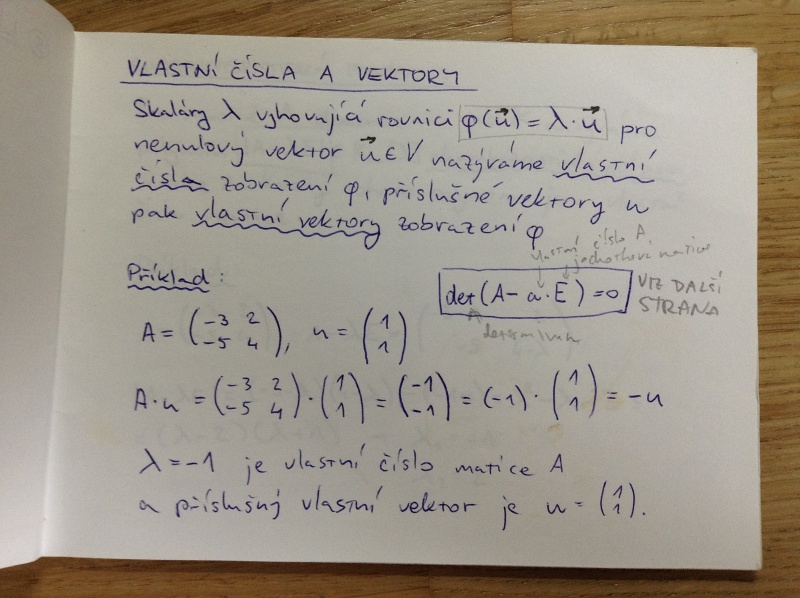
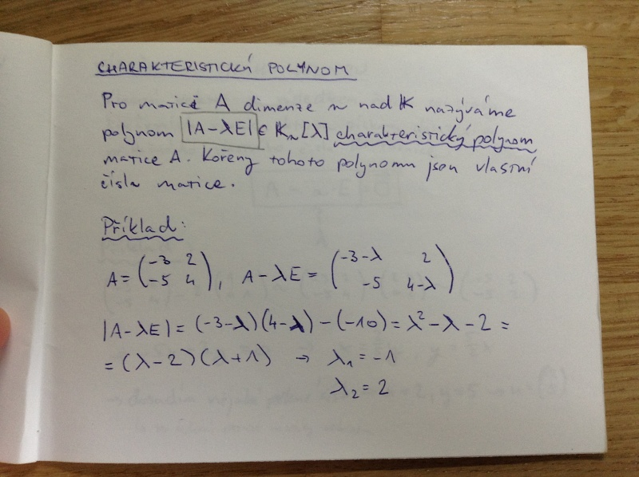
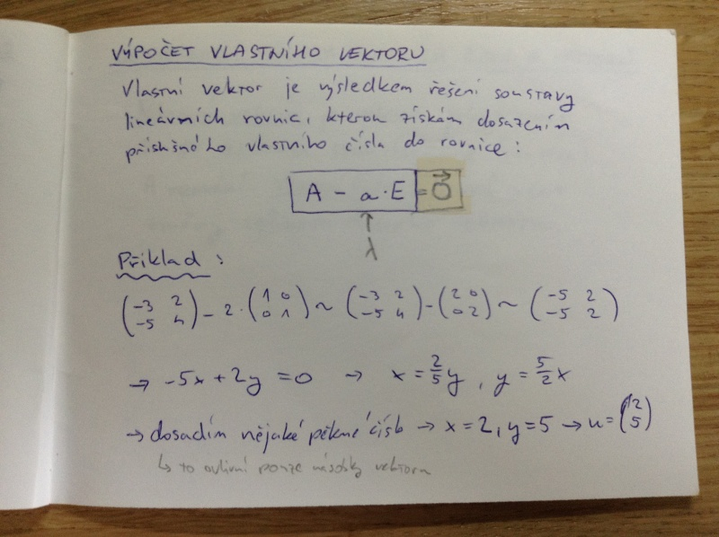
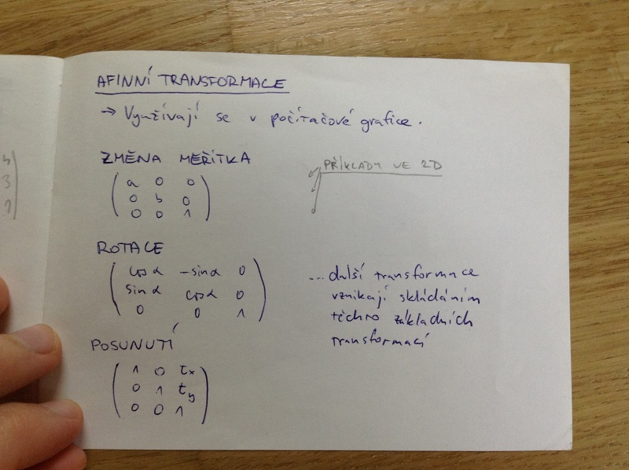

# Lineární algebra II.

- vlastní čísla a vektory
    - jejich geometrický význam
- inverzní matice
- vektorové podprostory
- vektorové báze
- afinní objekty
- afinní trasformace

## Vlastní čísla a vektory

Skaláry \lambda vyhovující rovnici \phi(u) = \lambda \cdot u pro nenulový vektor u \in V nazýváme _vlastní čísla_, zobrazení \phi přílušné vekteoru u pak _vlastní vektory_ zobrazení \phi.

|A - \lambda \cdot E| = 0

Příklad:

### Charakteristický polynom
Pro matici A dimenze n nad \Field nazýváme polynom |A - \lambda \cdot E| \in \Field_n[\lambda] _charakteristický polynom_ matice A. Kořeny tohoto polynomu jsou vlastní čísla matice.

Příklad:

### Výpočet vlastního vektoru
Vlastní vektor je výsledkem řešení soustavy lineárních rovnic, kterou získám dosazením příslušného vlastního čísla do rovnice.

A - \lambda \cdot E = O (vector)

Příklad:

### Geometrický význam vlastních čísel a vektorů
_Vlastní vektor_ je vektor, jehož směr se po aplikaci transformace(matice) A nemění. _Vlastní číslo_ je koeficient změny velikosti daného vektoru.

## Inverzní matice
Matice B^{-1} je inverzní k matici B, když

B \cdot B^{-1} = B^{-1} \cdot B = E

(A \cdot B)^{-1} = A^{-1} \cdot B^{-1}

### Výpočet inverzní matice
Z regulární matice (čtvercové, bez lineárně závislých řádků).

1. Vedle matice připíšeme jednotkovou matici.
2. Provádíme Gaussovu eliminaci, dokud na místě původní matice není jednotková matice.
3. Na místě jednotkové matice je inverzní matice k původní matici.

## Vektorový prostor (lineární prostor)

- neprázdná množina vektorů
- sčítání vektorů (komutativní a asociativní)
- násobení vektorů číslem (asociativní, distributivní vzhledem k sčítání vektorů, distributivní vzhledem k sčítání čísel, má nulový prvek)

## Vektorové podprostory
Vlastní vektory příslušející stejnému vlastnímu číslu tvoří (společně s nulovým vektorem) podprostor vektorového prostoru \Field^n.

Podprostor určitého vlastního čísla získáme vyjádřením vlastního vektoru pomocí reálných koeficientů.

Vlastní vektory příslušející různým vlastním číslům jsou _lineárně nezávislé_, tedy že žádný z vektrů nemůžeme vyjádřit jako lineární kombinaci ostatních vektorů (součet násobků).

## Vektorová báze
Podmnožina M \subset V se nazývá _báze_ vektorového prostoru V, jestliže <M> (podprostor vyjádřený s koeficienty) = V a M je lineárně nezávislá.

_Konečně rozměrný vektorový prostor_ má konečnou bázi.

_dimenze_ = počet prvků báze

_Nekonečně rozměrný vektorový prostor_ nemá konečnou bázi.

## Afinní prostor (A, V, +)
A je množina bodů, V je vektorový prostor, + je binární funkce funkce + : A + V -> A

Funkce + má nulový prvek, je asociativní a pro každé dva body a, b existuje jeden vektor v takový, že a + v = b

Jinak řečeno (Dominičina verze):

Buď V = \Real^n vektorový prostor. Standardní _afinní prostor_ A_n = \Real^n je _množina_ všech _bodů v \Real^n_ spolu s _operací_, která bodu A = (a_1, ..., a_n) a vektoru v = (v_1, ..., v_n) \in V (zaměření afinního prostoru) přiřadí bod A + v = (a_1 + v_1, ..., a_n + v_n) \in A_n

Operace splňuje následující vlastnosti:
- A + 0 = A pro všechna A \in A_n a nulový vektor 0 \in V
- A + (v + w) = (A + v) + w pro všechny vektory v, w \in V a body A \in A_n
- pro každé dva body A, B \in A_n existuje právě jeden vektor AB \in V takový, že A + AB = B

## Euklidovský prostor
Afinní prostor se skalárním součinem.

## Afinní objekty
_Afinní soustava souřadnic_ vznikne zafixováním jednoho bodu, tzv. počátku afinní souřadné soustavy; od tohoto bodu měříme vzdálenost.

_afinní podprostor_ = neprázdná podmnožina afinního prostoru
_zaměření afinního podprostoru_ = vektorový podprostor
_dimenze afinního podprostoru_ = dimenze jeho zaměření

Afinní podprostory odpovídají množinám řešení systémů n-k lineárně nezávislých rovnic v n proměnných (kde n je dimenze prostoru a k je dimenze podprostoru)

Průnik afinních podprostorů je afinní podprostor nebo prázdná množina.

## Afinní transformace
Využívají se v počítačové grafice.

Nejlépe vidět na obrázku:

