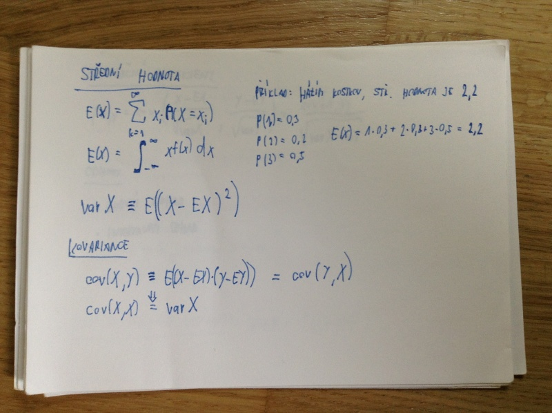
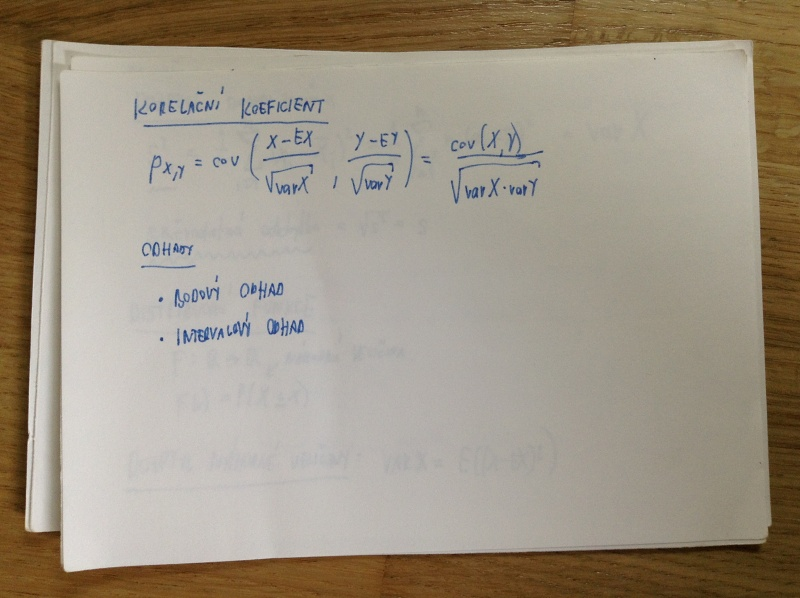
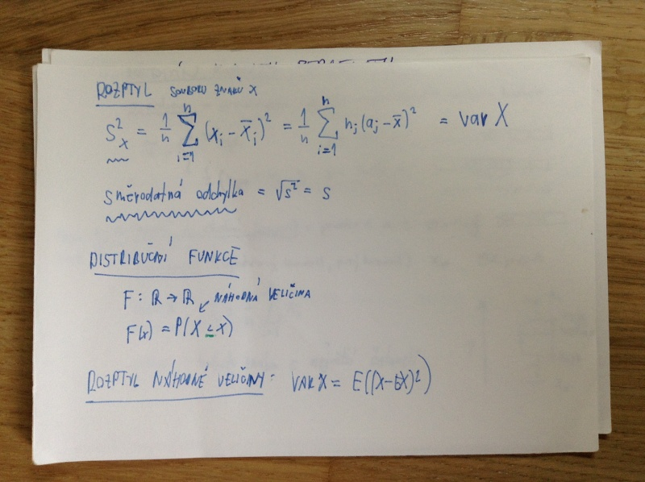
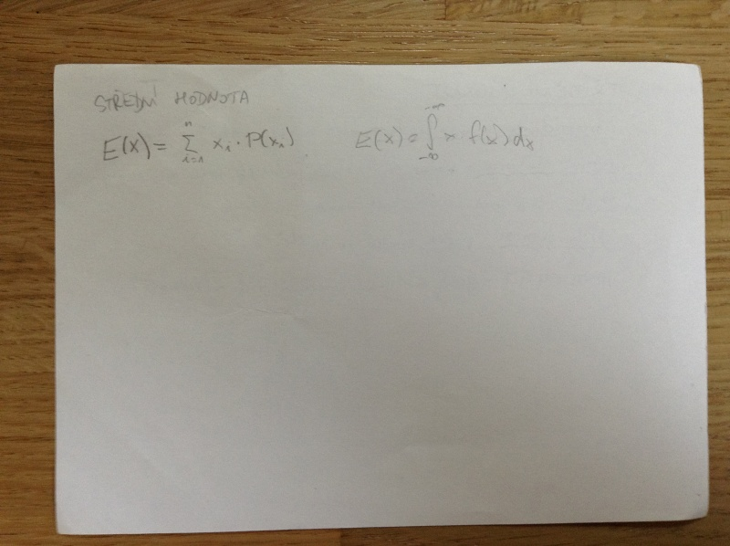
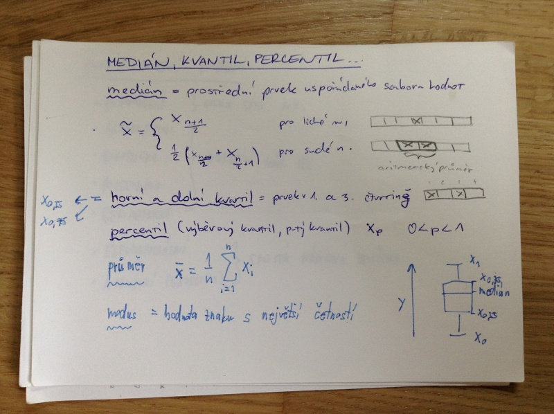
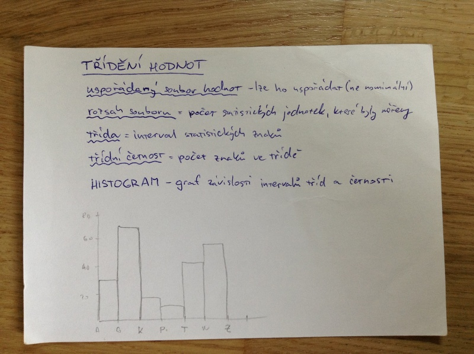

# Statistika
- popisná statistika
- střední hodnota
- medián
- rozptyl
- korelace
- odhady statistik a jejich spolehlivost
- distribuční funkce
- rozdělení náhodných veličin (+ příklady)

## Popisná statistika
Cílem _popisné statistiky_ je zpracování a zpřehledňování dat o objektech daného souboru.

_Matematická statistika_ se snaží určit relevanci statistik a zjistit teoretický model pro chování daného souboru.

_statistický soubor_ = množina _statistických jednotek_ (výčet/pravidla)

_statistický znak_ = vlastnost statistické jednotky

_soubor hodnot_ = (uspořádaná) množina vybraného statistického znaku

_měřítko_ - slouží k porovnání a poměřování hodnot

- _nominální měřítko_ - mezi hodnotami není žádný vztah (např. politické strany)
- _ordinální měřítko_ - mezi hodnotami není žádný vztah, ale lze je uspořádat (např. A, B, C, D)
- _intervalové měřítko_ - jde o porovnání velikostí, nikooli o absolutní hodnotu (např. teplota - poloha nuly není relevantní)
- _poměrové měřítko_ - pevně stanované měřítko i nula (např. délka v cm)

Vzorečky pro všechno na obrázcích:

## Medián, kvantil, percentil...
_medián_ = prostřední prvek uspořádaného souboru hodnot

pro lichý počet prvků v souboru medián je prostřední prvek, pro sudý počet jde o průměr prostředních dvou prvků

_horní a dolní kvantil_ = prvek 1. a 3. čtvrtiny

_percentil_ (výběrový vantil, p-tý kvantil) x_p, 0 < p < 1

_průměr_ = součet všech hodnot souboru dělený počtem hodnot v souboru

_modus_ = hodnota znaku s největší četností

Obrázek boxplotu:

## Pravděpodobnostní rozdělení
- diskrétní i spojitá náhodná veličina
    - rovnoměrné
- diskrétní náhodná veličina
    - alternativní
    - binomické
    - Poissonovo
    - geometrické
- spojitá náhodná veličina
    - exponenciální
    - normální (Gaussovo)

## Třídění hodnot
_uspořádaný soubor hodnot_ - lze ho uspořádat (ne nominální)

_rozsah souboru_ = počet statistických jednotek, které byly měřeny

_třída_ = interval statistických znaků

_třídní četnost_ = počet znaků ve třídě

Histogram - graf závislosti intervalů tříd a četnosti; obrázek:

