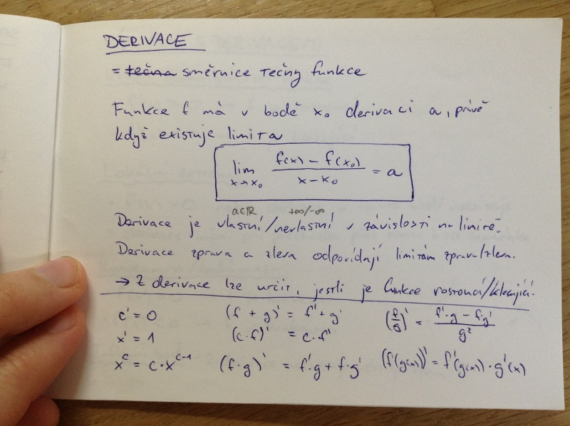
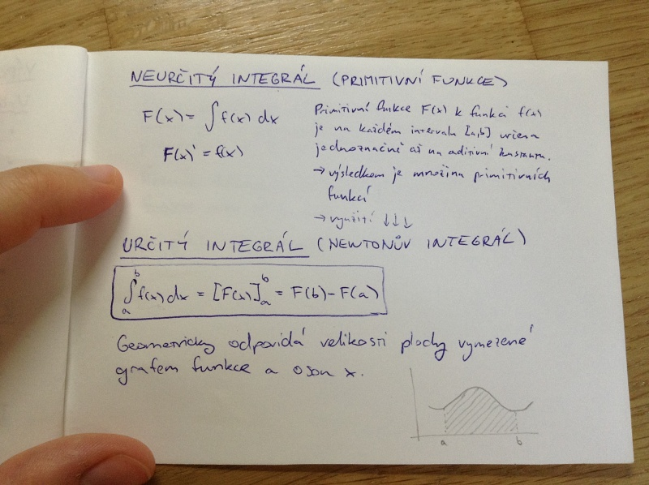

# Matematická analýza
- vlastnosti reálných funkcí
- polynomy
- spojité funkce a limity
- derivace
- neurčitý integrál
- určitý integrál
- geometrický význam
- diferenciální rovnice a jejich význam

## Vlastnosti reálných funkcí I.

_funkce_ = předpis, který každému číslu x z definičního oboru D(f) přiřadí nanejvýš jedno y z oboru hodnot H(f)

### Monotonnost funkce
_rostoucí funkce_ = x_1 < x_2 \implies f(x_1) < f(x_2)

_klesající funkce_ = x_1 < x_2 \implies f(x_2) < f(x_2)

_neklesající funkce_ = x_1 < x_2 \implies f(x_1) \leq f(x_2)

_nerostoucí funkce_ = x_1 < x_2 \implies f(x_1) \geq f(x_2)

_konstantní funkce_ = x_1 < x_2 \implies f(x_1) = f(x_2)

Funkce může klesat, růst, ... pouze na určitém _intervalu_.

## Vlastnosti reálných funkcí II.
_sudá funkce_ = f(x) = f(-x)

_lichá funkce_ = f(x) = -f(-x)

_prostá funkce_ = x_1 \neq x_2 \implies f(x_1) \neq f(x_2) (příma rovnoběžná s osou ji protne právě v jednom bodě)

_inverzní funkce_ = f(x) = y \equiv f^{-1}(y) = x

## Vlastnosti reálných funkcí III.

_shora omezená_ = \exists A \in \Real, pro všechny x \in D(f): A > f(x)

_zdola omezená_ = \exists A \in \Real, pro všechna x \in D(f): A < f(x)

_maximum funkce_ M = pro všechna x \in D(f): f(x) \leq f(M)

_minimum funkce_ M = pro všechna x \in D(f): f(x) \geq f(M)

_globální max/min_ - může jich být víc (může se realizovat pro více hodnot z definičního oboru)
_ostré max/min_ - je právě jedno

_periodická funkce_ - např. sin, cos, ...

## Polynomy (mnohočleny)
_polynom_ = výraz sestávající se z součtů, rozdílů, násobků a celočíselných mocnin proměnných

p(x) = \Sigma_{i=0}^n a_i \cdot x^i = a_0 \cdot x^0 + a_1 \cdot x^1 + a_2 \cdot x^2 + ... + a_n \cdot a_n \cdot x^n

a \in \Real ... koeficient

n ... stupeň mnohočlenu

_sčítání a odečítání_ - sčítáme/odečítáme koeficienty se stejným exponentmproměnné

_násobení_ - každý s každým

_vozrečky:_

(A + B)^2 = A^2 + 2AB + B^2

(A - B)^2 = A^2 - 2AB + B^2

(A + B)^3 = A^3 + 3A^2B + 3AB^2 + B^3

(A - B)^3 = A^3 - 3A^2B + 3AB^2 - B^3

A^2 - B^2 = (A + B)(A - B)

p^{A + B} = p^A \cdot p^B

p^{A - B} = p^A \ p^B

...

## Limity

### Limita posloupnosti
Posloupnost a_n má _vlastní limitu a_, jestliže ke každému \eps > 0 existuje n_0 \in \Nat takové, že pro všechna n > n_0 platí |a_n - a| < \eps.

### Limita funkce
Funkce f má v bodě x_0 _vlastní limitu ve vlastním bodě L_, jestliže platí:

(\forall \eps > 0)(\exists \delta > 0)(\forall x \in \Real): (0 < |x - x_0| < \delta \implies |f(x) - L| < \eps)

### Limita zleva a zprava
Limita v bodě existuje (uvnitř definičního oboru), právě když se limity zprava a zleva rovnají.

## Spojité funkce
Funkce f je _spojitá_ v bodě x_0, jestliže je v tomto bodě definovaná a limita funkce v tomto bodě se rovná její funkční hodnotě.

Každý polynom je spojitou funkcí na celém \Real.

Nechť f a g jsou spojité funkce v bodě x_0.

- f + g je spojitá v bodě x_0
- f \cdot g je spojitá v bodě x_0

## Derivace
= směrnice tečny funkce

Funkce f má v bodě x_0 derivaci _a_ právě, když existuje limita (vzoreček na obrázku):

Derivace je vlastní (když a \in \Real) / nevlastní (rovna kladnému nebo zápornému nekonečnu) v závislosti na limitě. Derivace zprava a zleva odpovídají limitám zprava/zleva.

-> Z defivace lze určit, jestli je funkce rostoucí/klesající.

Obrázek výše obsahuje taky některé vzorečky derivací.

## Výpočty s derivacemi

_Určení monotonnosti funkce_

- f'(x) > 0 \implies f je rostroucí
- f'(x) < 0 \implies f je klesající

_Lokální extrémy_

- f'(x) = 0 nebo derivace v tomto bodě neexistuje
- defivace mění při přechodu přes tento bod znaménko

_Konvexnost/konkávnost_

- f''(x) > 0 \implies f je konvexní
- f''(x) < 0 \implies f je konkávní

_Inflexní bod_ - druhá derivace neexistuje, nebo je rovna 0

## Neurčitý integrál (primitivní funkce)

Primitivní funkce F(x) k funkci f(x) je na každém intervalu [a,b] určena jednoznačně až na aditivní konstantu. Výsledkem je množina primiivních funkcí. Využití v newtonově integrálu.

### Určitý integrál (Newtonův integrál)

Vzoreček na obrázku:

Geometricky odpovídá velikosti plochy vymezené grafem funkce a osou x.

## Diferenciální rovnice
_diferenciální rovnice primitivního řádku_ = vztah mezi derivací funkce y'(t) v proměnné t, její hodnotou y(t) a samotnou proměnnou. F: \Real^3 -> \Real, F(y', y, t) = 0

Řešením diferenciální rovnice je funkce nebo třída funkcí.

př.: y'' + 2y' = 3y ... y = e^x (jedno z možných řešení)
