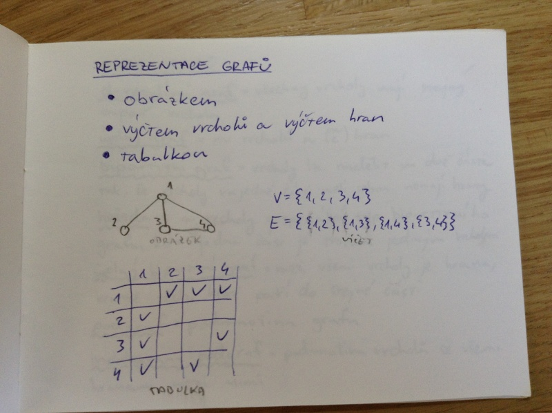

# Grafy
- typy grafů
- stromy
- stupně vrcholů
- orientované grafy
- reprezentace grafů
- algoritmy na prohledávání grafu
    - do hloubky
    - do šířky
    - využití
- komponenty souvislosti

## Graf G = (V, E)
_graf_ = uspořádaná dvojice množin vrcholů a hran

_stupeň vrcholu_ = počet hran u vrcholu

_cesta_ délky n = cesta o n hranách

_kružnice_ délky n = kružnice o n hranách

_izomorfismus_ = bijekce vrcholů, která zachová všechny hrany

_souvislost_ = graf je souvislý, pokud hrany propojují všechny jeho vrcholy

## Reprezentace grafů
- obrázkem
- výčtem vrcholů a výčtem hran
- tabulkou

Příklady:

## Typy grafů
_d-regulární graf_ = všechny vrcholy mají stejný stupeň vrcholu

_úplný graf_ = n vrcholů a „dva nad n“ hran

_bipartitiní graf_ = vrcholy lze rozdělit na dvě části tak, že vrcholy v jedné části mezi sebou nemají hrany

_hvězda_ s n vrcholy = speciální typ bipartitního grafu, kde jedna část je tvořena jedním vrcholem

_úplný bipartitní graf_ = mezi všemi vrcholy je hrana, kromě těch, které patří do stejné části

_podgraf_ = podmnožina grafu

_indukovaný podgraf_ = podmnožina vrcholů se všemi hranami mezi nimi

## Stromy
_strom_ = graf bez kružnic, minimální souvislý, maximální acyklický

_les_ = graf bez kružnic, který nemusí být souvislý

- strom s více než jedním vrcholem obsahuje vrchol stupně 1
- strom na n vrcholech má n - 1 hran pro n \geq 1
- mezi každými dvěma vrcholy stromu vede právě jedna cesta
- přidáním právě jedné hrany do stromu vnikne právě jedna kružnice

## Orientovaný graf
_orientovaný graf_ = uspořádaná dvojice D = (V, E), kde V je množina vrcholů a E \subset V \times V je množina hran

_vstupní stupeň_ vrcholu = počet hran vedoucích do vrcholu

_výstupní stupeň_ vrcholu = počet hran vedoucích z vrcholu

## Souvislost na orientovaných grafech
_slabá souvislost_ = odpovídá souvislostí neorientovaného grafu (zanedbáme orientovanost)

_dosažitelnost_ = graf je dosažitelný, pokud v něm existuje vrchol, ze kterého vede cesta do všech ostatních

_silná souvislost_ = mezi každou dvojicí vrcholů existuje cesta tam i zpátky

_silně souvislá komponenta_ = podčást grafu, která je silně souvislá

## Procházení grafu do šířky (BFS)
Využívá se fronta, do které jsou vkládáný sousední vrcholy právě prozkoumaného vrcholu, které ještě nebyly označeny za navštívené; vrchol se za navštívený označí při přidávání do fronty.

### Dijkstrův algoritmus = hledání nejkratší cesty
Z fronty vybere vždy nejbližší vrchol od počátečního vrcholu, postupně přepočítává minimální vzdálenost do všech vrcholů

### Jarníkův algoritmus = hledání minimální kostry
Vybírá nejbližší vrchol od již zpracované části.

## Procházení grafu do hloubky (DFS)
Prohledávání do hloubky využívá zásobník, do kterého vkládá sousední vrcholy, které ještě nebyly označeny za navštívené; vrchol se za navštívený označí při přidávání na zásobník.

_Využití:_ topologické uspořádání uzlů, nalezení silných komponent, zjištění acykličnosti grafu
