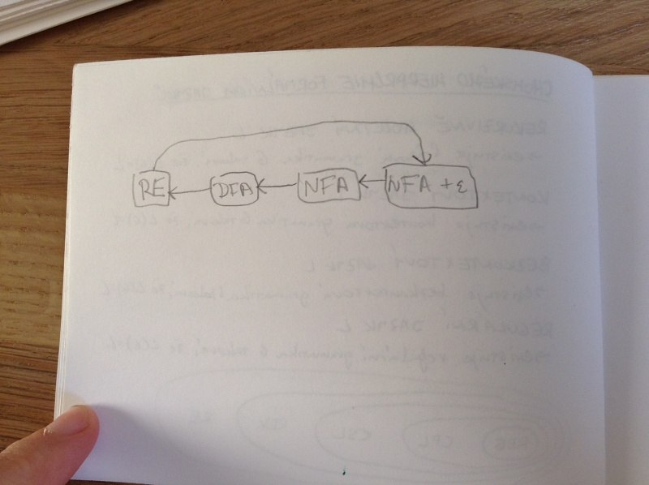
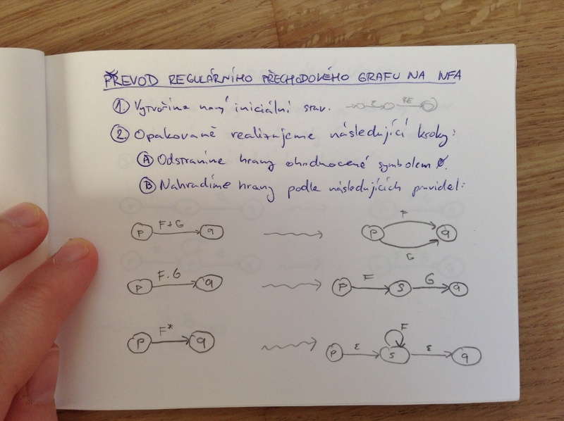
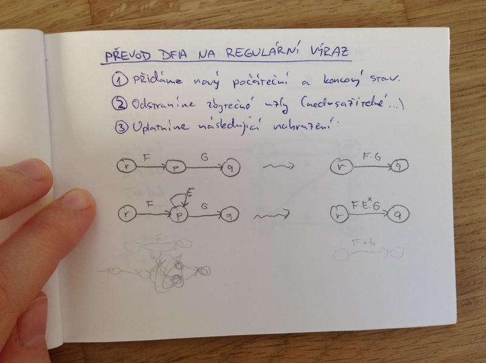
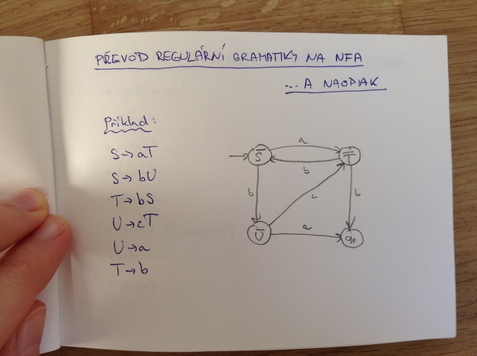

# Formální jazyky I.
- Chomského hierarchie formálních jazyků
- regulární jazyky
    - reprezentace
    - převody
- varianty konečných automatů
- nedeterminismus a determinizace automatů
- uzávěrové vlastnosti regulárních jazyků

## Formální jazyky
_abeceda_ = libovolná konečná množina znaků

_slovo_ nad abecedou Σ je libovolná konečná posloupnost znaků této abecedy

_jazyk_ nad abecedou Σ je libovolná konečná množina slov nad Σ

_gramatika_ G je popis jazyka pomocí pravidel, podle kterých se vytvářejí slova daného jazyka

## Chomského hierarchie gramatik

- frázové gramatiky
    - bez omezení pravidel
- kontextové gramatiky
    - pro každé pravidlo α -> β platí |α| ≤ |β|
    - výjimka: S -> ϵ, pokud S není v pravé straně žádného pravidla
- bezkontextové gramatiky (bez ϵ-pravidel)
    - pravidla tvaru A -> α, kde |α| ≥ 1
    - výjimka: S -> ϵ, pokud S není v pravé straně žádného pravidla
- regulární gramatiky
    - pravidla tvaru A -> aB nebo A -> a
    - výjimka: S -> ϵ, pokud S není v pravé straně žádného pravidla

## Chomského hierarchie formálních jazyků

- rekurzivně spočetný jazyk L
    - existuje frázová gramatika G taková, že L(G) = L, nebo Turingův stroj takový, že akceptuje právě slova z L
- kontextový jazyk L
    - existuje kontextová gramatika G taková, že L(G) = L, nebo LBA takový, že akceptuje právě slova z L
- bezkontextový jazyk L
    - existuje bezkontextová gramatika G taková, že L(G) = L, nebo zásobníkový automat takvý, že akceptuje právě slova z L
- regulární jazyk L
    - existuje regulární gramatika G taková, že L(G) = L, nebo deterministický konečný autamat, který akceptuje právě slova z L

Tyto jazyky jsou v inkluzi, navíc existuje třída regulárních jazyků, která je strikně menší než množina rekurzivně spočetných jazyků a zároveň je striktní nadmnožinou kontextových jazyků.

## Regulární jazyky: reprezentace
- slovní popis
- regulární gramatika
- konečný automat (přechodovou funkcí, tabulkou nebo grafem)
    - deterministický konečný (minimální, kanonický) automat
    - nedeterministický konečný automat
    - automat s epsilon kroky
- regulární výrazy

## Graf známých algoritmů na převod mezi možnými popisy regulárních jazyků

## Gramatika
G = (N, Σ, P, S)

N ... neprázdná konečná množina _neterminálů_

Σ ... konečná množina _terminálů: (N ∪ Σ = Ø)

P ... konečná množina _pravidel_

P ⊂ V*.N.V* × V* V = N ∩ Σ

S ∈ N ... _počáteční neterminál_

## Konečný automat (deterministický)

A = (Q, Σ, δ, q_0, F)

Q ... neprázdná konečná množina _stavů_

Σ ... konečná _vstupní abeceda_

δ : Q × Σ -> Q ... parciální _přechodová funkce_

q_0 ∈ Q ... _iniciální stav_

F ⊂ Q ... množina _akceptujících stavů_

## Výpočet konečného automat
_rozšířená přechodová funkce_ δ^ : Q × Σ* -> Q

δ^(q, ϵ) = q pro každý stav q ∈ Q

δ^(q, wa) = δ(δ^(q, w), a) je-li δ^(q, w) i δ(δ^(q, w), a) definováno, ⊥ jinak.

Slovo w je _akceptováno_ automatem A, právě když δ^(q_0, w) ∈ F.

Slovo w je _zamítáno_ automatem A, právě když δ^(q_0, w) ∉ F.

_Jazyk přijímaný automatem A_ je L(A) = {w ∈ Σ* | δ^(q_0, w) ∈ F}

Automaty jsou _ekvivalentní_, pokud přijímají stejný jazyk.

## Převod na minimální konečný automat

1. Odstraníme nedosažitelné stavy.
2. Přidáme „peklo“ a svedeme do něj nedefinované přechody.
3. Rozdělíme stavy na koncové a nekoncové a přeznačíme přechody podle toho, do které skupiny vedou.
4. Spojíme stavy do nových skupin, pokud se shodují na tom, do jaké skupiny z předchozího kroku vedly. A opět přeznačíme, do které skupiny vedou nyní.
5. Bod 4 opakujeme, dokud lze vytvářet nové skupiny. Následně spojím ekvivalentní stavy do jednoho a nově očísluji.

## Převod na kanonický tvar

1. Seřadím abecedu do přirozeného pořadí.
2. Označím iniciální stav ->
3. Označím koncové stavy <-

U automatů v kanonickém tvaru můžeme snadno srovnávat, jestli jsou stejné.

## Nedeterministický konečný automat

A = (Q, Σ, δ, q_0, F)

Q ... neprázdná konečná množina _stavů_

Σ ... konečná _vstupní abeceda_

δ : Q × Σ -> 2^Q ... totální _přechodová funkce_

q_0 ∈ Q ... _iniciální stav_

F ⊂ Q ... množina _akceptujících stavů_

### Rozšířená přechodová funkce δ^ : Q × Σ* -> 2^Q

δ^(q, ϵ) = {q}

δ^(q, wa) = ∪_{p ∈ δ&(q, w)} δ(p, a)

## Převod NFA na DFA

1. Přepíšeme řádek z tabulky pro iniciální stav
2. Přidáme nové stavy, které jsou sloučením stavů, do kterých se můžeme pod jedním znakem dostat z iniciálního stavu. Přechody do těchto stavů vzniknou sloučením všech obsahových stavů (jejich původních přechodů).
3. Stavy přidáváme, dokud se nám generují nové.

DFA může být ve výsledku až exponenciálně větší.

## Regulární výrazy

Definice množiny regulárních výrazů nad abecedou Σ. RE je:

- ϵ, Ø a a pro každé a ∈ Σ
- (E.F), (E+F), (E)*, pokud E a F jsou RE
- každý RE vnikne konečným počtem aplikací prvních dvou pravidel

Každý RE E nad abecedou Σ popisuje jazyk L(E) nad stejnou abecedou:

L(ϵ) = {ϵ}
L(Ø) = Ø
L(a) = {a} pro každé a ∈ Σ
L(E.F) = L(E).L(F)
L(E+F) = L(E) ∪ L(F)
L(E*) = L(E)*

## Regulární přechodový graf

A = (Q, Σ, δ, q_0, F)

Q ... neprázdná konečná množina _stavů_

Σ ... konečná _vstupní abeceda_

δ : Q × Q -> RE(Σ) ... parciální _přechodová funkce_

I ⊂ Q ... množina _iniciálních stavů_

F ⊂ Q ... množina _akceptujících stavů_

## Převod regulárního přechodového grafu na NFA

1. vytvoříme nový iniciální stav
2. Opakovaně realizujeme následující kroky:
    1. Ostraníme hrany ohodnocené symbolem Ø
    2. Nahradíme hrany podle následujících pravidel:

## Převod DFA na regulární výraz

1. přidáme nový počáteční stav a koncový stav
2. odstraníme zbytečné uzly (nedosažitelné...)
3. uplatníme následující nahrazení:

## Převod regulární gramatiky na NFA ... a naopak

## Uzávěrové vlastnosti regulárních jazyků

- sjednocení
- průnik
- rozdíl
- doplněk
- zřetězení
- iterace (i pozitivní)
- mocnění
- revers
