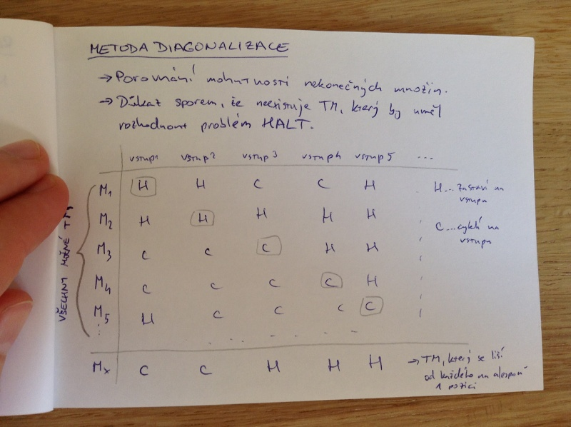

# Vyčíslitelnost
- Turingův stroj
- problém zastavení
- rozhodnutelnost
- částečná rozhodnutelnost
- nerozhodnutelnost
- metoda redukce
- metoda diagonalizace

## Turingův stroj (deterministický)

M = (Q, Σ, Γ, \tri, \space, δ, q_0, q_acc, q_rej)

Q ... konečná množina stavů

Σ ... konečná vstupní abeceda

Γ ... konečná pracovní abeceda, Σ ⊂ Γ

\tri ∈ Γ - Σ ... levá koncová značka

\space ∈ Γ - Σ ... znakča prázdného políčka

δ : (Q - {q_acc, q_rej}) × Γ -> Q × Γ × {L, R} ... totální přechodová funkce

q_0 ∈ Q ... počáteční stav

q_acc ∈ Q ... akceptující stav

q_rej ∈ Q ... zamítající stav

Pro každé q ∈ Q existuje p ∈ Q takový, že δ(q, \tri) = (p, \tri, R). (\tri nelze přepsat, nelze se posunout za levý okraj pásky)

## Turingův stroj II.

_Konfigurace_ Turingova stroje

(q, z, n) ∈ Q × {y\space^ω | y ∈ Γ*} × ℕ_0

_počáteční konfigurace_ pro vstup w ∈ Σ* je (q_0, \triw\space^ω, 0)

_akceptující konfigurace_ je každá trojice tvaru (q_acc, z, n)

_zamítající konfigurace_ je každá trojice tvar (q_rej, z, n)

Vícepáskový i nedeterministický TV jsou ekvivalentní deterministickému TM.

_Úplný TM_ se vstupní abecedou Σ má všechny výpočty konečné (rozhoduje rekurzivní jazyky).

## Výpočet Turingova stroje

_krok výpočtu_

(p, z, n) ⊢_M (q, s_b^n(z), n + 1) pro δ(p, z_n) = (q, b, R) a (q, s_b^n(z), n - 1) pro δ(p, z_n) = (q, b, L)

_výpočet_ TM M na vstupu w je maximální posloupnost konfigurací k_0, k_1, ... kde k_0 je počáteční konfigurace pro w a k_i ⊢_M k_i+1 pro i ≥ 0.

Stroj M _akceptuje_ slovo w právě, když je výpočet M na w konečný a jeho poslední konfigurace je akceptující.

Stroj M _zamítá_ slovo w právě, když je výpočet M na w konečný a jeho poslední konfigurace je zamítající.

Stroj M _cyklí_ pro vstup w právě, když je výpočet M na w nekonečný.

_Jazyk akceptovaný_ M: L(M) = {w ∈ Σ* | M akceptuje w}

## Problém zastavení (HALT)
= problém rozhodnout, zda daný TM M má na daném slově w nad jeho vstupní abecedou konečný výpočet.

HALT = {<M,w> | M je TM a výpočet M na w je konečný}

Problém zastavení je _částečně rozhodnutelný_:
- pomocí univerzálního TM simulujeme M na w. Pokud simulovaný výpočet skončí, akceptujeme.

Problém zasatavní je _nerozhodnutelný_:
- Důkaz sporem pomocí problému akceptování (místo zamítajících stavů začne cyklit).

## Rozhodnutelnost

### Rozhodnutelný problém
- právě když L je rekurzivní
- také jeho doplněk je rozhodnutelný
- existuje úplný TM, který ho akceptuje (existuje TM, který ho rozhoduje)

### Nerozhodnutelný problém
- právě když L není rekurzivní

### Částečně rozhodnutelný (semirozhodnutelný problém)
- právě když L je rekurzivně spočetný
- jeho doplněk není rozhodnutelný
- existuje TM, který ho akceptuje
- např. ACC, HALT

## Vyčíslitelnost
Funkce f : Σ* -> Φ* je _vyčíslitelná_, pokud existuje TM M, který na vstupu w zastaví, právě když f(w) je definovaný a navíc f(w) = M(w).

Funkce je _totálně vyčíslitelná_, pokud je vyčíslitelná a totální. 

## Metoda redukce
Nechť A ⊂ Σ* a B ⊂ Φ* jsou jazyky. Řekněme, že A se _m-redukuje_ na B, píšeme A ≤_m B, právě když existuje totálě vyčíslitelná funkce f : Σ* -> Φ* taková, že w ∈ A ≡ f(w) ∈ B.

Funkci f nazveme _redukcí_ A na B.

A a B jsou _m-ekvivalentní_, píseme A ≡_m B, pokud A ≤_m B a B ≤_m A.

## Redukce a rozhodnutelnost

Nechť A ≤_m B:
- B je rekurzivní ⇒ A je rekurzivní
- B je rekurzivně spočetný => A je rekurzivně spočetný
- A není rekurzivní => B není rekurzivní
- A není rekurzivně spočetný => B není rekurzivně spočetný

Nechť A ≡_m B:
- A je rekurzivní ≡ B je rekurzivní
- A je rekurzivně spočetný ≡ B je rekurzivně spočetný

## Metoda diagonalizace
- Porovnání mohutnosti nekonečných množin.
- Důkaz sporem, že neexistuje TM, který by uměl rozhodnout HALT.

Obrázek:

