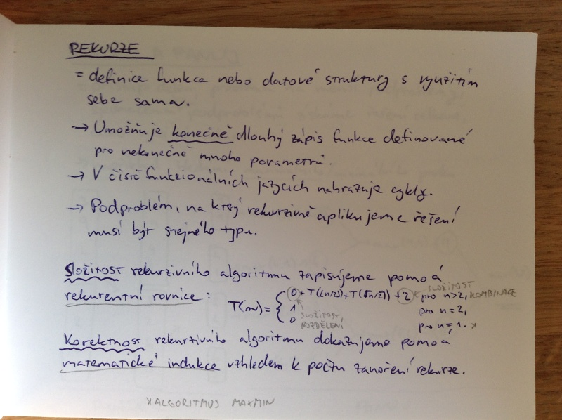
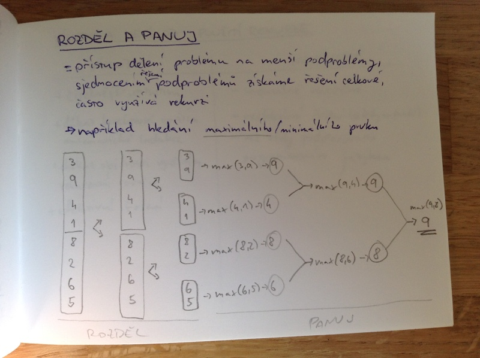
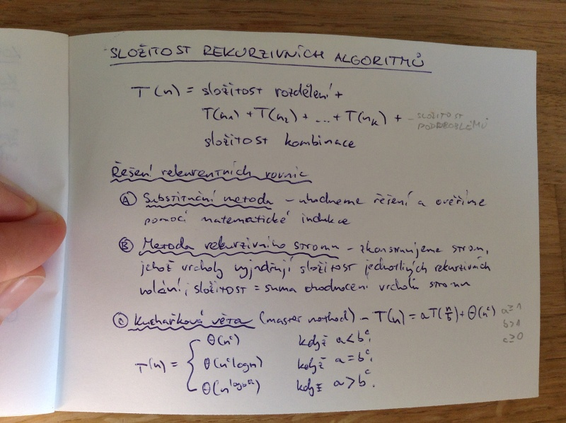

# Rekrurzivní algoritmy
- metoda rozděl a panuje
- výhody a nevýhody použití rekruze
- odstranění rekurze
- vysvětlení principů a implementace řadicích rekurzivních algoritmů
- vztah rekurze a matematické indukce

## Rekurze
= definice funkce nebo datové struktury s využitím sebe sama

- Umožňuje _konečně_ dlouhý zápis funkce definované pro nekonečně mnoho parametrů.
- V čistě funkcionálních jazycích nahrazuje cykly.
- Podproblém, na který rekurzivně aplikujeme řešení, musí být stejného typu.

_Složitost_ rekurzivního algoritmu zapisujeme pomocí _rekurzivní rovnice_:

_Korektnost_ rekruzivního algoritmu dokazujeme pomocí _matematické indukce_ vzhledem k počtu zanoření rekurze.

## Rozděl a panuj
= přístup dělení problému na menší podproblémy, sjednocením řešení podproblémů získáme řešení celkové často využívá rekurzi

- například hledání maximálního/minimálního prvku

## Výhody a nevýhody použití rekurze

### Výhody
- čitelnější, intuitivní
- důkaz korektnosti využívá matematické indukce
- důkaz složitosti využitím rekurentní rovnice
- efektivní řešení

### Nevýhody
- mentálně náročné
- neefektivní řešení (nároky na paměť)
- ne vždy podporováno programovacím jazykem

## Odstranění rekurze
Každý rekurzivní algoritmus lze převést na iterativní.

- Nahrazení _cyklem_ nebo více vnořenými cykly.
- Nahrazení _zásobníkem_ (zpravidla u složitějších problémů, kde by byly cykly nepřehledné).

## Merge sort Θ(n log(n))
1. Rozděl posloupnost na dvě poloviny. Θ(n)
2. Rekurzivně vyřeš obě posloupnosti. 2 · T(n/2)
3. Kombinuj dvě seřazené posloupnosti do jedné (merge). Θ(n)

(posloupnost o jednom prvku je seřazená)

## Quick sort Θ(n log n) až Θ(n^2)
1. Výběr pivotu.
2. Rozděl poslounpst na dvě - menší než pivot a větší než pivot.
3. Rekruzivně vyřeš obě posloupnosti.
4. Kombinuj již seřazené posloupnosti.

## Korektnost rekurzivních algoritmů
_Konečnost_ výpočtu plyne z faktu, že každé rekurzivní volání se provede pro posloupnost menší délky.

_Správnost_ vypočítavého výsledku dokážeme indukcí vzhledem k délce vstupu.

1. Báze (např. minimum z posloupnosti délky jedna je sám prvek, pro dva prvky je to ten větší)
2. Indukční předpoklad - předpokládá, že algoritmus vrací korektní výsledek pro všechny kratší vstupy.
3. Platnost tvrzení pro n.

## Složitost rekurzivních algoritmů

T(n) = složitost rozdělení + T(n_1) + T(n_2) + ... + T(n_k) + složitost kombinace

### Řešení rekurzivních rovnic
1. Substituční metoda - uhodneme řešení a ověříme pomocí matematické indukce.
2. Metoda rekurzivního stromu - zkonstruujeme strom, jehož vrcholy vyjadřují složitost jednotlivých rekurzivních volání, složitost = suma ohodnocení vrcholů stromu.
3. Kuchařková věta (master theorem) - T(n) = aT(n/b) + Θ(n^c)

